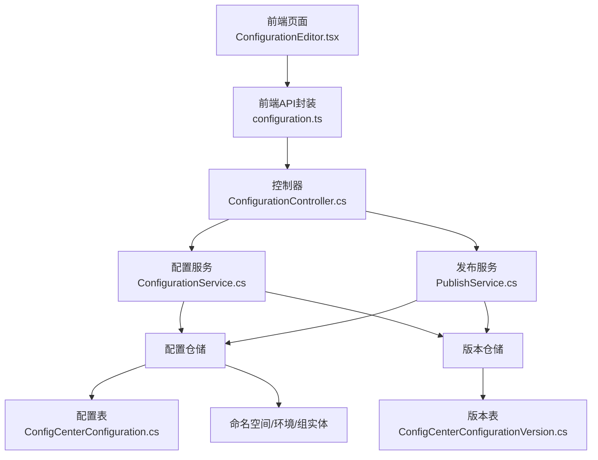
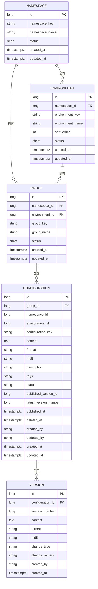
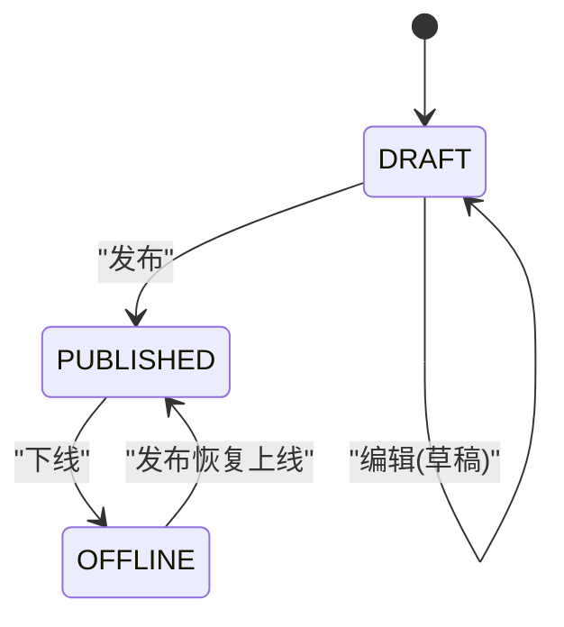
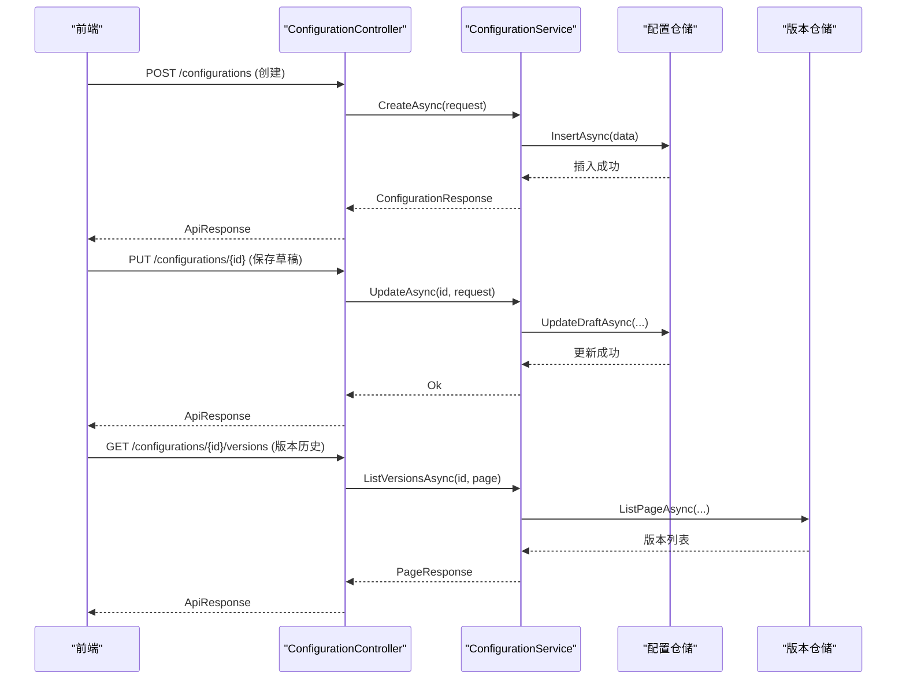
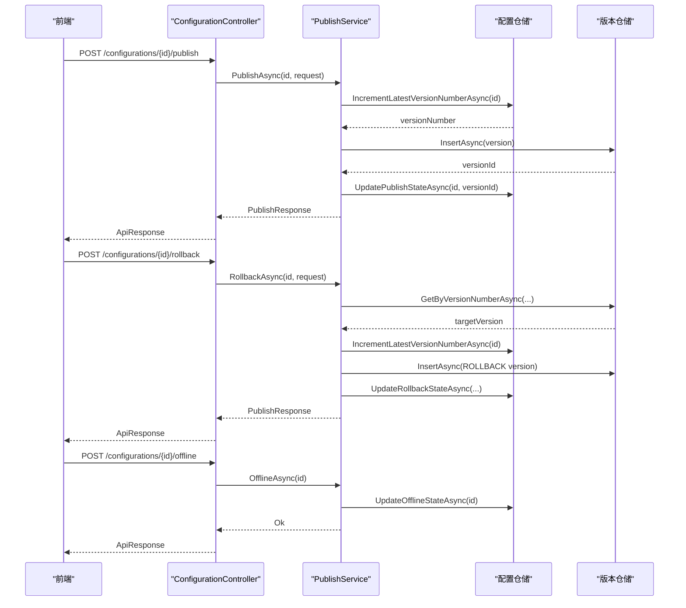
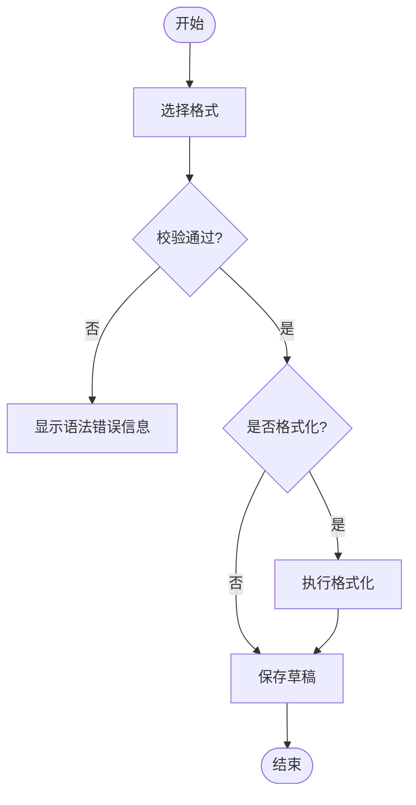
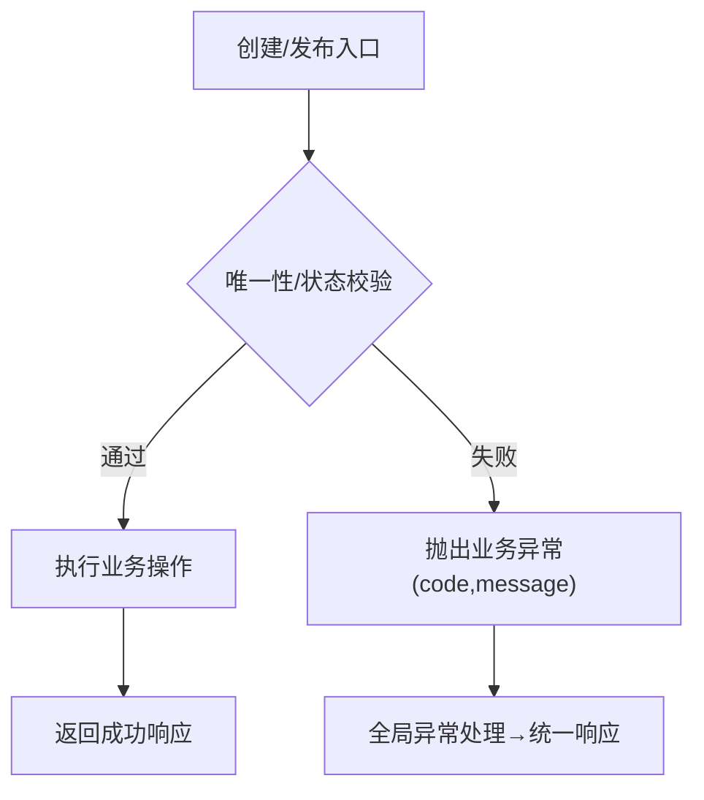
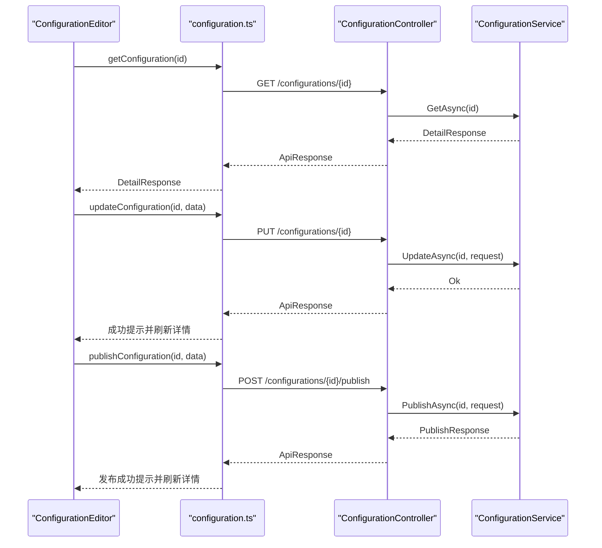
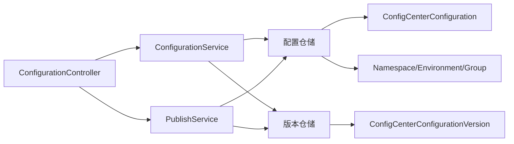

# 配置管理

<cite>
**本文引用的文件**
- [ConfigurationController.cs](file://k_config_center/src/Controllers/ConfigurationController.cs)
- [ConfigurationService.cs](file://k_config_center/src/Services/ConfigurationService.cs)
- [PublishService.cs](file://k_config_center/src/Services/PublishService.cs)
- [ConfigCenterConfiguration.cs](file://k_config_center/src/Entities/ConfigCenterConfiguration.cs)
- [ConfigCenterConfigurationVersion.cs](file://k_config_center/src/Entities/ConfigCenterConfigurationVersion.cs)
- [ConfigCenterNamespace.cs](file://k_config_center/src/Entities/ConfigCenterNamespace.cs)
- [ConfigCenterEnvironment.cs](file://k_config_center/src/Entities/ConfigCenterEnvironment.cs)
- [ConfigCenterConfigurationGroup.cs](file://k_config_center/src/Entities/ConfigCenterConfigurationGroup.cs)
- [ConfigurationRequests.cs](file://k_config_center/src/Models/Requests/ConfigurationRequests.cs)
- [ConfigurationResponses.cs](file://k_config_center/src/Models/Responses/ConfigurationResponses.cs)
- [BusinessException.cs](file://k_config_center/src/Infrastructure/BusinessException.cs)
- [configuration.ts](file://web/src/api/configuration.ts)
- [ConfigurationEditor.tsx](file://web/src/pages/configuration/ConfigurationEditor.tsx)
- [FormatSelect.tsx](file://web/src/components/FormatSelect.tsx)
- [formatters.ts](file://web/src/utils/formatters.ts)
</cite>

## 目录
1. [简介](#简介)
2. [项目结构](#项目结构)
3. [核心组件](#核心组件)
4. [架构总览](#架构总览)
5. [详细组件分析](#详细组件分析)
6. [依赖关系分析](#依赖关系分析)
7. [性能考虑](#性能考虑)
8. [故障排查指南](#故障排查指南)
9. [结论](#结论)
10. [附录：API 与前端集成](#附录api-与前端集成)

## 简介
本文件面向“配置中心”的配置管理能力，系统性阐述配置的完整生命周期（创建、编辑、删除、发布、回滚、下线），以及四级组织架构（namespace → environment → group → configuration）的设计原理与实现机制。文档覆盖配置项的 CRUD、状态机（DRAFT/PUBLISHED/OFFLINE）、内容格式支持（text/json/yaml/properties/xml/toml）、唯一性约束与冲突检测、错误处理、编辑流程与草稿保存、前端编辑器组件实现细节，并提供完整的 API 调用示例与前端集成指引。

## 项目结构
后端采用控制器-服务-仓储-实体分层；前端基于 React + Ant Design + Monaco Editor，提供配置编辑、格式化校验、版本历史查看等能力。关键路径如下：
- 控制器层：接收请求并委派到服务层
- 服务层：编排业务逻辑（编辑/发布/回滚/下线）
- 仓储层：数据访问与事务编排
- 实体层：数据库表映射
- 模型层：请求/响应契约
- 前端：页面、组件、API 封装、格式化器

图表来源
- [ConfigurationController.cs:1-115](file://k_config_center/src/Controllers/ConfigurationController.cs#L1-L115)
- [ConfigurationService.cs:1-110](file://k_config_center/src/Services/ConfigurationService.cs#L1-L110)
- [PublishService.cs:1-116](file://k_config_center/src/Services/PublishService.cs#L1-L116)
- [ConfigCenterConfiguration.cs:1-66](file://k_config_center/src/Entities/ConfigCenterConfiguration.cs#L1-L66)
- [ConfigCenterConfigurationVersion.cs:1-39](file://k_config_center/src/Entities/ConfigCenterConfigurationVersion.cs#L1-L39)
- [ConfigCenterNamespace.cs:1-39](file://k_config_center/src/Entities/ConfigCenterNamespace.cs#L1-L39)
- [ConfigCenterEnvironment.cs:1-39](file://k_config_center/src/Entities/ConfigCenterEnvironment.cs#L1-L39)
- [ConfigCenterConfigurationGroup.cs:1-45](file://k_config_center/src/Entities/ConfigCenterConfigurationGroup.cs#L1-L45)

章节来源
- [ConfigurationController.cs:1-115](file://k_config_center/src/Controllers/ConfigurationController.cs#L1-L115)
- [ConfigurationService.cs:1-110](file://k_config_center/src/Services/ConfigurationService.cs#L1-L110)
- [PublishService.cs:1-116](file://k_config_center/src/Services/PublishService.cs#L1-L116)

## 核心组件
- 配置项实体：承载当前态内容与状态，包含 key、content、format、md5、status、published_version_id、latest_version_number 等字段，支持软删除与审计字段。
- 版本快照实体：不可变的历史快照，记录每次发布的 content/format/md5/change_type/change_remark/crtime。
- 维度实体：namespace/environment/group 构成四级组织，配置项通过 group_id 归属到具体组，并通过冗余字段 namespace_id/environment_id 提升查询效率。
- 配置服务：负责配置项的列表、详情、新建、编辑（草稿）、删除、版本历史与单个版本快照读取。
- 发布服务：负责发布、回滚、下线，保证版本号原子递增、快照写入、生效指针切换与日志落库的一致性。
- 控制器：对外暴露 RESTful 接口，统一参数接收与响应包装。

章节来源
- [ConfigCenterConfiguration.cs:1-66](file://k_config_center/src/Entities/ConfigCenterConfiguration.cs#L1-L66)
- [ConfigCenterConfigurationVersion.cs:1-39](file://k_config_center/src/Entities/ConfigCenterConfigurationVersion.cs#L1-L39)
- [ConfigCenterNamespace.cs:1-39](file://k_config_center/src/Entities/ConfigCenterNamespace.cs#L1-L39)
- [ConfigCenterEnvironment.cs:1-39](file://k_config_center/src/Entities/ConfigCenterEnvironment.cs#L1-L39)
- [ConfigCenterConfigurationGroup.cs:1-45](file://k_config_center/src/Entities/ConfigCenterConfigurationGroup.cs#L1-L45)
- [ConfigurationService.cs:1-110](file://k_config_center/src/Services/ConfigurationService.cs#L1-L110)
- [PublishService.cs:1-116](file://k_config_center/src/Services/PublishService.cs#L1-L116)
- [ConfigurationController.cs:1-115](file://k_config_center/src/Controllers/ConfigurationController.cs#L1-L115)

## 架构总览
配置中心的四层组织架构为：命名空间(namespace) → 环境(environment) → 配置组(group) → 配置项(configuration)。配置项在组内以 key 唯一，发布后生成不可变版本快照，客户端仅能读取 PUBLISHED 状态的配置。

图表来源
- [ConfigCenterNamespace.cs:1-39](file://k_config_center/src/Entities/ConfigCenterNamespace.cs#L1-L39)
- [ConfigCenterEnvironment.cs:1-39](file://k_config_center/src/Entities/ConfigCenterEnvironment.cs#L1-L39)
- [ConfigCenterConfigurationGroup.cs:1-45](file://k_config_center/src/Entities/ConfigCenterConfigurationGroup.cs#L1-L45)
- [ConfigCenterConfiguration.cs:1-66](file://k_config_center/src/Entities/ConfigCenterConfiguration.cs#L1-L66)
- [ConfigCenterConfigurationVersion.cs:1-39](file://k_config_center/src/Entities/ConfigCenterConfigurationVersion.cs#L1-L39)

## 详细组件分析

### 配置项实体与状态机
- 状态：DRAFT（草稿）、PUBLISHED（已发布）、OFFLINE（已下线）。
- 发布时：版本号原子递增，写入版本快照，更新 published_version_id 与 status 为 PUBLISHED。
- 下线时：status 置 OFFLINE，不产生版本记录。
- 未发布变更判定：当 status 为 PUBLISHED 且当前 md5 与 published_version_id 指向版本的 md5 不一致，或从未发布过，则视为存在未发布变更。

图表来源
- [ConfigCenterConfiguration.cs:1-66](file://k_config_center/src/Entities/ConfigCenterConfiguration.cs#L1-L66)
- [PublishService.cs:24-92](file://k_config_center/src/Services/PublishService.cs#L24-L92)

章节来源
- [ConfigCenterConfiguration.cs:1-66](file://k_config_center/src/Entities/ConfigCenterConfiguration.cs#L1-L66)
- [PublishService.cs:24-92](file://k_config_center/src/Services/PublishService.cs#L24-L92)

### 配置项 CRUD 与版本管理
- 创建：初始状态 DRAFT，版本号 0；组内 key 唯一，重复返回冲突错误码。
- 编辑（草稿）：只更新 content/format/md5/description/tags，不产生版本、不改变 status。
- 删除：软删除，保留版本快照与操作日志。
- 版本历史：按版本号倒序分页；单个版本快照供 Diff 使用。

图表来源
- [ConfigurationController.cs:34-113](file://k_config_center/src/Controllers/ConfigurationController.cs#L34-L113)
- [ConfigurationService.cs:46-102](file://k_config_center/src/Services/ConfigurationService.cs#L46-L102)

章节来源
- [ConfigurationController.cs:34-113](file://k_config_center/src/Controllers/ConfigurationController.cs#L34-L113)
- [ConfigurationService.cs:46-102](file://k_config_center/src/Services/ConfigurationService.cs#L46-L102)

### 发布/回滚/下线流程
- 发布：检查是否无未发布变更；事务内执行「版本号+1 → 写版本快照 → 切换生效指针 → 写日志」；并发冲突捕获并返回重试提示。
- 回滚：以目标历史版本内容重新发布，change_type=ROLLBACK，不回退版本号，保持线性递增可追溯；当前态同步为该历史值。
- 下线：仅 PUBLISHED 可下线，status 置 OFFLINE，不产生版本。

图表来源
- [ConfigurationController.cs:65-94](file://k_config_center/src/Controllers/ConfigurationController.cs#L65-L94)
- [PublishService.cs:24-92](file://k_config_center/src/Services/PublishService.cs#L24-L92)

章节来源
- [ConfigurationController.cs:65-94](file://k_config_center/src/Controllers/ConfigurationController.cs#L65-L94)
- [PublishService.cs:24-92](file://k_config_center/src/Services/PublishService.cs#L24-L92)

### 内容格式支持与验证规则
- 支持格式：text/json/yaml/properties/xml/toml。
- 前端校验：按格式注册表进行语法校验与美化；json 额外要求非空；properties/toml 行级校验；xml 使用 DOMParser 校验。
- 编辑器：Monaco 语言映射，properties/toml 映射到 ini 以获得近似高亮；text 映射到 plaintext。
- 服务端：md5 由服务端计算，不信任前端传值；保存草稿不产生版本。

图表来源
- [ConfigurationEditor.tsx:52-58](file://web/src/pages/configuration/ConfigurationEditor.tsx#L52-L58)
- [formatters.ts:17-157](file://web/src/utils/formatters.ts#L17-L157)
- [ConfigurationEditor.tsx:38-45](file://web/src/pages/configuration/ConfigurationEditor.tsx#L38-L45)

章节来源
- [ConfigurationEditor.tsx:38-58](file://web/src/pages/configuration/ConfigurationEditor.tsx#L38-L58)
- [formatters.ts:17-157](file://web/src/utils/formatters.ts#L17-L157)
- [FormatSelect.tsx:5-13](file://web/src/components/FormatSelect.tsx#L5-L13)

### 唯一性约束、冲突检测与错误处理
- 唯一性：同配置组内 configuration_key 唯一；创建时若冲突返回业务错误码。
- 冲突检测：发布时若已是 PUBLISHED 且当前 md5 与生效版本 md5 一致，拒绝重复发布；并发发布冲突捕获唯一约束异常并返回重试提示。
- 错误处理：业务异常携带 code/message，全局中间件统一转为 HTTP 200 + code 表达错误。

图表来源
- [ConfigurationService.cs:49-63](file://k_config_center/src/Services/ConfigurationService.cs#L49-L63)
- [PublishService.cs:27-53](file://k_config_center/src/Services/PublishService.cs#L27-L53)
- [BusinessException.cs:1-11](file://k_config_center/src/Infrastructure/BusinessException.cs#L1-L11)

章节来源
- [ConfigurationService.cs:49-63](file://k_config_center/src/Services/ConfigurationService.cs#L49-L63)
- [PublishService.cs:27-53](file://k_config_center/src/Services/PublishService.cs#L27-L53)
- [BusinessException.cs:1-11](file://k_config_center/src/Infrastructure/BusinessException.cs#L1-L11)

### 前端编辑器组件实现细节
- 加载详情：获取当前编辑态与生效版本快照，初始化编辑器内容与格式。
- 本地脏标记：编辑内容变化设置 dirty，用于轮询冲突提示与发布前警告。
- 低频轮询：每 10s 拉取详情，对比 updatedAt 发现他人修改时提示刷新。
- 保存草稿：先校验内容，再调用更新接口；成功后刷新详情。
- 发布弹窗：仅发布服务端已保存内容；若本地有未保存修改给出警告。
- 格式选择与格式化：FormatSelect 固定选项；getFormatter 提供 validate/format；Monaco 语言映射。

图表来源
- [ConfigurationEditor.tsx:94-178](file://web/src/pages/configuration/ConfigurationEditor.tsx#L94-L178)
- [configuration.ts:18-47](file://web/src/api/configuration.ts#L18-L47)
- [ConfigurationController.cs:22-73](file://k_config_center/src/Controllers/ConfigurationController.cs#L22-L73)
- [ConfigurationService.cs:34-77](file://k_config_center/src/Services/ConfigurationService.cs#L34-L77)

章节来源
- [ConfigurationEditor.tsx:94-178](file://web/src/pages/configuration/ConfigurationEditor.tsx#L94-L178)
- [configuration.ts:18-47](file://web/src/api/configuration.ts#L18-L47)

## 依赖关系分析
- 控制器依赖服务：ConfigurationController 依赖 ConfigurationService 与 PublishService。
- 服务依赖仓储与服务间协作：ConfigurationService 依赖配置与版本仓储；PublishService 依赖配置与版本仓储及事务编排。
- 实体与数据库：各实体对应数据库表，配置项冗余 namespace_id/environment_id 以提升查询性能。
- 前端依赖：ConfigurationEditor 依赖 API 封装、格式化器与 Monaco 编辑器。

图表来源
- [ConfigurationController.cs:1-115](file://k_config_center/src/Controllers/ConfigurationController.cs#L1-L115)
- [ConfigurationService.cs:1-110](file://k_config_center/src/Services/ConfigurationService.cs#L1-L110)
- [PublishService.cs:1-116](file://k_config_center/src/Services/PublishService.cs#L1-L116)
- [ConfigCenterConfiguration.cs:1-66](file://k_config_center/src/Entities/ConfigCenterConfiguration.cs#L1-L66)
- [ConfigCenterConfigurationVersion.cs:1-39](file://k_config_center/src/Entities/ConfigCenterConfigurationVersion.cs#L1-L39)
- [ConfigCenterNamespace.cs:1-39](file://k_config_center/src/Entities/ConfigCenterNamespace.cs#L1-L39)
- [ConfigCenterEnvironment.cs:1-39](file://k_config_center/src/Entities/ConfigCenterEnvironment.cs#L1-L39)
- [ConfigCenterConfigurationGroup.cs:1-45](file://k_config_center/src/Entities/ConfigCenterConfigurationGroup.cs#L1-L45)

章节来源
- [ConfigurationController.cs:1-115](file://k_config_center/src/Controllers/ConfigurationController.cs#L1-L115)
- [ConfigurationService.cs:1-110](file://k_config_center/src/Services/ConfigurationService.cs#L1-L110)
- [PublishService.cs:1-116](file://k_config_center/src/Services/PublishService.cs#L1-L116)

## 性能考虑
- 列表查询优化：一次性取出所有生效版本的 md5 做内存比对，避免逐条回查数据库。
- 冗余字段：配置项冗余 namespace_id/environment_id，减少 JOIN 开销。
- 版本号原子递增：通过仓储层 RETURNING 行锁串行化，避免并发竞态。
- 前端轮询：低频轮询（10s）降低服务器压力，仅在本地未编辑时提示刷新。

[本节为通用性能建议，不直接分析具体文件]

## 故障排查指南
- 资源不存在：GET/PUT/DELETE 等操作对不存在的配置返回资源不存在错误码。
- 重复发布：已是 PUBLISHED 且无未发布变更时拒绝重复发布。
- 回滚版本不存在：指定版本号不存在时返回相应错误。
- 下线限制：仅 PUBLISHED 状态可下线。
- 并发冲突：发布并发冲突捕获唯一约束异常并返回重试提示。
- 全局错误：业务异常携带 code/message，统一响应便于前端处理。

章节来源
- [ConfigurationController.cs:22-94](file://k_config_center/src/Controllers/ConfigurationController.cs#L22-L94)
- [ConfigurationService.cs:34-87](file://k_config_center/src/Services/ConfigurationService.cs#L34-L87)
- [PublishService.cs:27-92](file://k_config_center/src/Services/PublishService.cs#L27-L92)
- [BusinessException.cs:1-11](file://k_config_center/src/Infrastructure/BusinessException.cs#L1-L11)

## 结论
配置中心通过清晰的四级组织架构与严格的状态机设计，实现了配置从草稿到发布、回滚、下线的完整生命周期管理。服务端保障唯一性、并发安全与一致性，前端提供友好的编辑器与校验能力，整体架构解耦清晰、扩展性强，适合多环境、多团队的配置治理需求。

[本节为总结性内容，不直接分析具体文件]

## 附录：API 与前端集成

### 后端 API 概览（配置项）
- 列表：GET /api/configurations?groupId=&namespaceId=&environmentId=&status=&keyword=
- 详情：GET /api/configurations/{id}
- 创建：POST /api/configurations
- 保存草稿：PUT /api/configurations/{id}
- 删除：DELETE /api/configurations/{id}
- 发布：POST /api/configurations/{id}/publish
- 回滚：POST /api/configurations/{id}/rollback
- 下线：POST /api/configurations/{id}/offline
- 版本历史：GET /api/configurations/{id}/versions?pageIndex=&pageSize=
- 版本快照：GET /api/configurations/{id}/versions/{versionNumber}

章节来源
- [ConfigurationController.cs:14-113](file://k_config_center/src/Controllers/ConfigurationController.cs#L14-L113)

### 请求/响应模型要点
- 创建请求：GroupId、ConfigurationKey、Content、Format（默认 text）、Description、Tags。
- 更新请求：Content、Format（默认 text）、Description、Tags。
- 发布请求：ChangeRemark（可选）。
- 回滚请求：VersionNumber、ChangeRemark（可选）。
- 响应：列表含 hasUnpublishedChange；详情含 configuration 与 publishedVersion；版本历史分页；版本快照含 content/format/md5/change_type/change_remark。

章节来源
- [ConfigurationRequests.cs:1-27](file://k_config_center/src/Models/Requests/ConfigurationRequests.cs#L1-L27)
- [ConfigurationResponses.cs:1-75](file://k_config_center/src/Models/Responses/ConfigurationResponses.cs#L1-L75)

### 前端集成要点
- API 封装：configuration.ts 提供 list/get/create/update/delete/publish/rollback/offline/versions/getVersion。
- 编辑器：ConfigurationEditor.tsx 使用 Monaco，按 format 高亮；保存草稿与发布分离；本地 dirty 标记与轮询冲突提示。
- 格式选择：FormatSelect.tsx 固定选项；formatters.ts 提供 validate/format 注册表。

章节来源
- [configuration.ts:18-59](file://web/src/api/configuration.ts#L18-L59)
- [ConfigurationEditor.tsx:38-178](file://web/src/pages/configuration/ConfigurationEditor.tsx#L38-L178)
- [FormatSelect.tsx:5-13](file://web/src/components/FormatSelect.tsx#L5-L13)
- [formatters.ts:17-157](file://web/src/utils/formatters.ts#L17-L157)