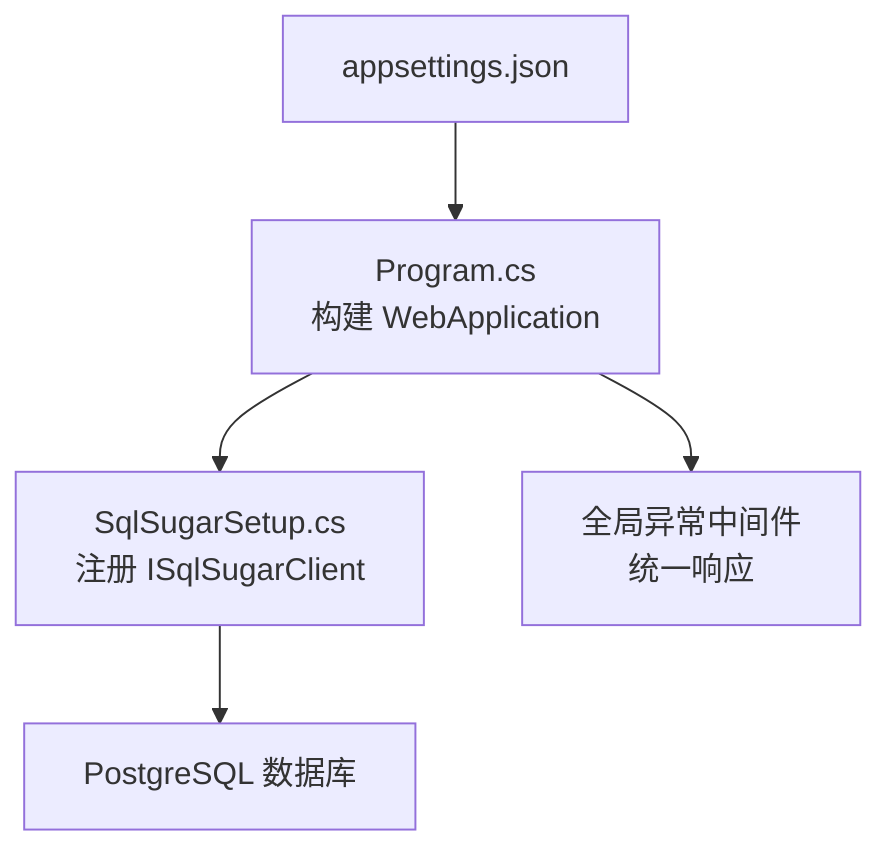
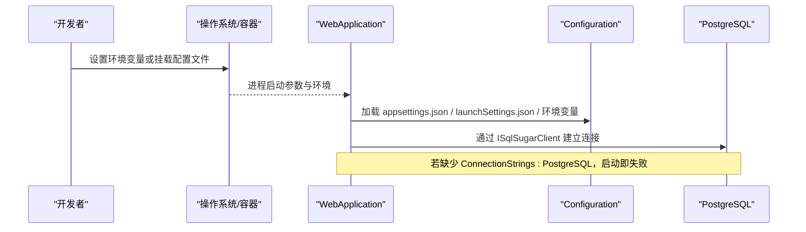
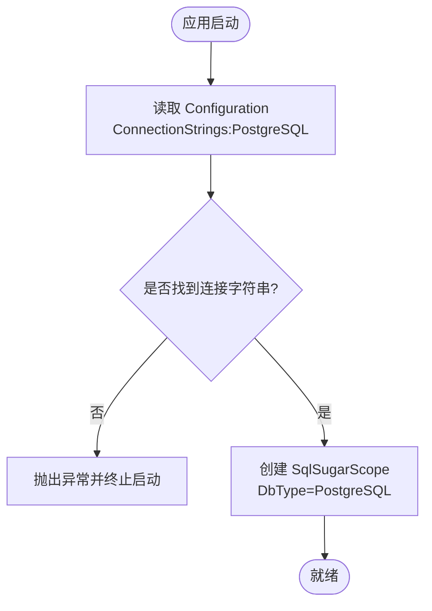
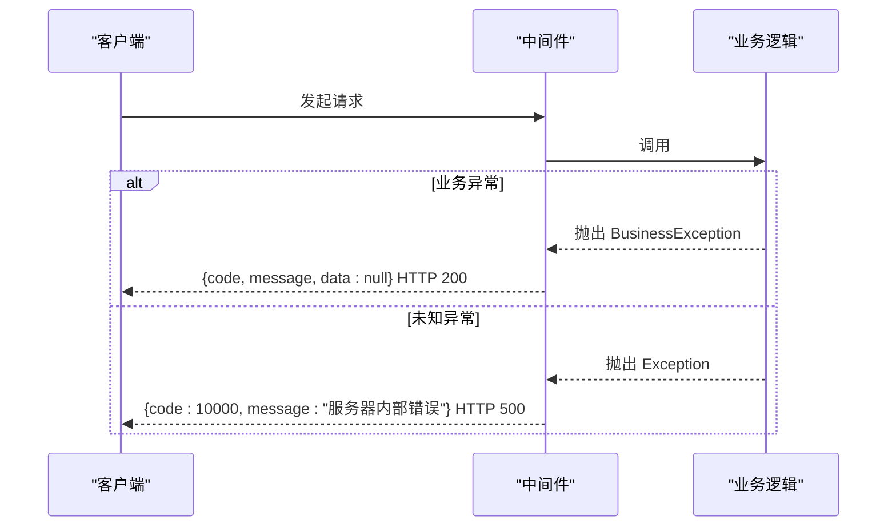
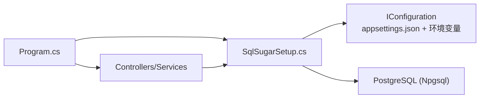

# 环境配置

<cite>
**本文引用的文件**
- [appsettings.json](file://k_config_center/appsettings.json)
- [Program.cs](file://k_config_center/Program.cs)
- [SqlSugarSetup.cs](file://k_config_center/src/Infrastructure/SqlSugarSetup.cs)
- [后端方案.md](file://docs/技术方案/后端方案.md)
- [launchSettings.json](file://k_config_center/Properties/launchSettings.json)
- [BusinessException.cs](file://k_config_center/src/Infrastructure/BusinessException.cs)
- [ApiResponse.cs](file://k_config_center/src/Infrastructure/ApiResponse.cs)
- [k_config_center.csproj](file://k_config_center/k_config_center.csproj)
</cite>

## 目录
1. [简介](#简介)
2. [项目结构](#项目结构)
3. [核心组件](#核心组件)
4. [架构总览](#架构总览)
5. [详细组件分析](#详细组件分析)
6. [依赖关系分析](#依赖关系分析)
7. [性能注意事项](#性能注意事项)
8. [故障排查指南](#故障排查指南)
9. [结论](#结论)
10. [附录](#附录)

## 简介
本文件面向“配置中心”项目的运行环境与系统配置，重点说明 appsettings.json 中各配置项的作用与配置方法，包括日志级别、允许的 Host、PostgreSQL 数据库连接字符串等；解释环境变量注入方式与生产环境安全最佳实践；提供开发、测试、生产环境的配置模板与示例；并说明配置校验与错误处理机制。

## 项目结构
本项目为 .NET Web 应用，采用 ASP.NET Core 的 Configuration 体系：
- 配置文件：appsettings.json（默认）、launchSettings.json（本地调试）
- 启动与管道：Program.cs
- 数据访问初始化：src/Infrastructure/SqlSugarSetup.cs（读取 ConnectionStrings:PostgreSQL）
- 依赖与驱动：k_config_center.csproj（Npgsql、SqlSugarCore）

图表来源
- [Program.cs:10-61](file://k_config_center/Program.cs#L10-L61)
- [SqlSugarSetup.cs:12-39](file://k_config_center/src/Infrastructure/SqlSugarSetup.cs#L12-L39)

章节来源
- [appsettings.json:1-12](file://k_config_center/appsettings.json#L1-L12)
- [Program.cs:10-61](file://k_config_center/Program.cs#L10-L61)
- [k_config_center.csproj:12-18](file://k_config_center/k_config_center.csproj#L12-L18)

## 核心组件
- 配置源
  - appsettings.json：定义 Logging、AllowedHosts、ConnectionStrings:PostgreSQL
  - launchSettings.json：本地调试时设置 ASPNETCORE_ENVIRONMENT
- 运行时装配
  - Program.cs：构建服务容器、注册 SqlSugar、启用 Swagger（仅开发）、全局异常处理、静态文件与路由
- 数据访问初始化
  - SqlSugarSetup.cs：从 IConfiguration 读取 ConnectionStrings:PostgreSQL，创建 ISqlSugarClient 单例，并设置全局软删除过滤器

章节来源
- [appsettings.json:1-12](file://k_config_center/appsettings.json#L1-L12)
- [launchSettings.json:1-24](file://k_config_center/Properties/launchSettings.json#L1-L24)
- [Program.cs:10-107](file://k_config_center/Program.cs#L10-L107)
- [SqlSugarSetup.cs:12-39](file://k_config_center/src/Infrastructure/SqlSugarSetup.cs#L12-L39)

## 架构总览
下图展示配置如何从文件与环境变量进入应用，并在启动时被读取与使用：

图表来源
- [Program.cs:10-61](file://k_config_center/Program.cs#L10-L61)
- [SqlSugarSetup.cs:12-39](file://k_config_center/src/Infrastructure/SqlSugarSetup.cs#L12-L39)

## 详细组件分析

### appsettings.json 配置项说明
- Logging.LogLevel
  - Default：默认日志级别
  - Microsoft.AspNetCore：框架日志级别
  - 作用：控制控制台/文件等输出器的详细程度
- AllowedHosts
  - 值：* 表示允许所有 Host 头；生产建议限制为具体域名或 IP
- ConnectionStrings.PostgreSQL
  - 格式：Host;Port;Database;Username;Password
  - 作用：供 SqlSugarSetup 读取并建立 PostgreSQL 连接

章节来源
- [appsettings.json:1-12](file://k_config_center/appsettings.json#L1-L12)

### PostgreSQL 数据库连接配置
- 连接字符串键名：ConnectionStrings:PostgreSQL
- 必需字段：Host、Port、Database、Username、Password
- 读取位置：SqlSugarSetup 在 AddSqlSugarSetup 中通过 configuration.GetConnectionString("PostgreSQL") 获取
- 缺失处理：若未配置，将抛出异常阻止启动，避免运行期才暴露问题

图表来源
- [SqlSugarSetup.cs:12-39](file://k_config_center/src/Infrastructure/SqlSugarSetup.cs#L12-L39)

章节来源
- [SqlSugarSetup.cs:12-39](file://k_config_center/src/Infrastructure/SqlSugarSetup.cs#L12-L39)
- [后端方案.md:157-182](file://docs/技术方案/后端方案.md#L157-L182)

### 环境变量与多环境配置
- 环境变量
  - ASPNETCORE_ENVIRONMENT：用于区分 Development/Staging/Production
  - launchSettings.json 中已设置为 Development（本地调试）
- 配置优先级（由低到高）
  - 基础配置（如 appsettings.json）
  - 环境特定配置（如 appsettings.Development.json）
  - 环境变量（可覆盖上述配置）
  - 命令行参数
- 推荐做法
  - 敏感信息（数据库密码等）不要写入仓库，应通过环境变量或密钥管理服务注入
  - 生产环境显式设置 ASPNETCORE_ENVIRONMENT=Production，并关闭不必要的调试特性（如 Swagger UI）

章节来源
- [launchSettings.json:1-24](file://k_config_center/Properties/launchSettings.json#L1-L24)
- [Program.cs:64-69](file://k_config_center/Program.cs#L64-L69)

### 生产环境安全最佳实践
- 禁止将凭据提交到代码库；使用环境变量或外部密钥管理
- 限制 AllowedHosts 为受信任域名/IP
- 仅在开发环境启用 Swagger UI
- 使用 HTTPS 重定向（已启用 UseHttpsRedirection）
- 最小化日志中的敏感信息，避免泄露连接串或用户数据

章节来源
- [Program.cs:64-69](file://k_config_center/Program.cs#L64-L69)
- [Program.cs:94-99](file://k_config_center/Program.cs#L94-L99)

### 不同环境的配置模板与示例
以下为基于当前仓库结构的模板指引（请根据实际环境替换占位符）：
- 开发（Development）
  - 日志级别：Information
  - AllowedHosts：*
  - 连接字符串：指向本地或开发 PostgreSQL
  - 环境变量：ASPNETCORE_ENVIRONMENT=Development
- 测试（Staging）
  - 日志级别：Warning 或 Information（按需要）
  - AllowedHosts：限定测试域名
  - 连接字符串：指向测试数据库
  - 环境变量：ASPNETCORE_ENVIRONMENT=Staging
- 生产（Production）
  - 日志级别：Warning 或 Error（减少噪音）
  - AllowedHosts：严格限定生产域名
  - 连接字符串：通过环境变量注入，开启 SSL（如适用）
  - 环境变量：ASPNETCORE_ENVIRONMENT=Production

注意：以上为通用模板，具体值需结合部署平台（容器、云平台、CI/CD）进行配置。

[本节为概念性模板说明，不直接引用具体代码文件]

### 配置验证与错误处理
- 启动时验证
  - 若缺少 ConnectionStrings:PostgreSQL，将在服务注册阶段抛出异常，阻止应用启动
- 请求级异常处理
  - 业务异常 BusinessException：统一返回 { code, message, data: null }，HTTP 状态码仍为 200
  - 非业务异常：记录结构化日志后返回 500 内部服务器错误，避免泄露内部细节
- 错误码约定
  - 见后端方案文档的错误码分段约定（0、10000+、20000+、30000+）

图表来源
- [Program.cs:71-92](file://k_config_center/Program.cs#L71-L92)
- [BusinessException.cs:1-11](file://k_config_center/src/Infrastructure/BusinessException.cs#L1-L11)
- [ApiResponse.cs:1-10](file://k_config_center/src/Infrastructure/ApiResponse.cs#L1-L10)
- [后端方案.md:482-496](file://docs/技术方案/后端方案.md#L482-L496)

章节来源
- [Program.cs:71-92](file://k_config_center/Program.cs#L71-L92)
- [BusinessException.cs:1-11](file://k_config_center/src/Infrastructure/BusinessException.cs#L1-L11)
- [ApiResponse.cs:1-10](file://k_config_center/src/Infrastructure/ApiResponse.cs#L1-L10)
- [后端方案.md:482-496](file://docs/技术方案/后端方案.md#L482-L496)

## 依赖关系分析
- 运行时依赖
  - Npgsql：PostgreSQL 驱动
  - SqlSugarCore：ORM，用于连接与查询
- 配置依赖
  - IConfiguration：读取 appsettings.json 与环境变量
- 模块耦合
  - Program.cs 负责服务注册与管道
  - SqlSugarSetup.cs 依赖 IConfiguration 获取连接字符串
  - 控制器/服务通过 DI 获取 ISqlSugarClient

图表来源
- [Program.cs:10-34](file://k_config_center/Program.cs#L10-L34)
- [SqlSugarSetup.cs:12-39](file://k_config_center/src/Infrastructure/SqlSugarSetup.cs#L12-L39)
- [k_config_center.csproj:12-18](file://k_config_center/k_config_center.csproj#L12-L18)

章节来源
- [k_config_center.csproj:12-18](file://k_config_center/k_config_center.csproj#L12-L18)
- [Program.cs:10-34](file://k_config_center/Program.cs#L10-L34)
- [SqlSugarSetup.cs:12-39](file://k_config_center/src/Infrastructure/SqlSugarSetup.cs#L12-L39)

## 性能注意事项
- 连接池与自动关闭
  - SqlSugarScope 已启用 IsAutoCloseConnection=true，有助于资源释放
- 日志级别
  - 生产环境建议提高日志级别以减少 I/O 开销
- 主机限制
  - 精确设置 AllowedHosts 可减少不必要的主机头检查

[本节为通用性能建议，不直接引用具体代码文件]

## 故障排查指南
- 启动时报缺少连接字符串
  - 现象：启动阶段抛出异常
  - 原因：未配置 ConnectionStrings:PostgreSQL
  - 处理：在 appsettings.json 或环境变量中补充该配置
- 无法连接数据库
  - 现象：连接失败或超时
  - 排查：核对 Host、Port、Database、Username、Password；确认网络可达与防火墙策略
- 请求返回 500
  - 现象：非业务异常被捕获并记录日志
  - 处理：查看服务端日志定位堆栈；修正业务逻辑或依赖问题
- 请求返回 200 但 code 非成功
  - 现象：BusinessException 被捕获，返回统一业务错误结构
  - 处理：根据 code 与 message 定位业务问题

章节来源
- [SqlSugarSetup.cs:12-39](file://k_config_center/src/Infrastructure/SqlSugarSetup.cs#L12-L39)
- [Program.cs:71-92](file://k_config_center/Program.cs#L71-L92)

## 结论
本项目的配置以 appsettings.json 为基础，结合环境变量实现多环境管理；数据库连接通过 ConnectionStrings:PostgreSQL 注入并在启动时严格校验；全局异常处理确保对外响应一致且安全。生产环境应遵循最小权限、最小暴露面与敏感信息外置的原则，保障稳定与安全。

## 附录
- 关键路径参考
  - 配置入口：appsettings.json
  - 启动与管道：Program.cs
  - 数据库初始化：SqlSugarSetup.cs
  - 错误模型与响应：BusinessException.cs、ApiResponse.cs
  - 依赖声明：k_config_center.csproj

[本节为索引性内容，不直接引用具体代码文件]