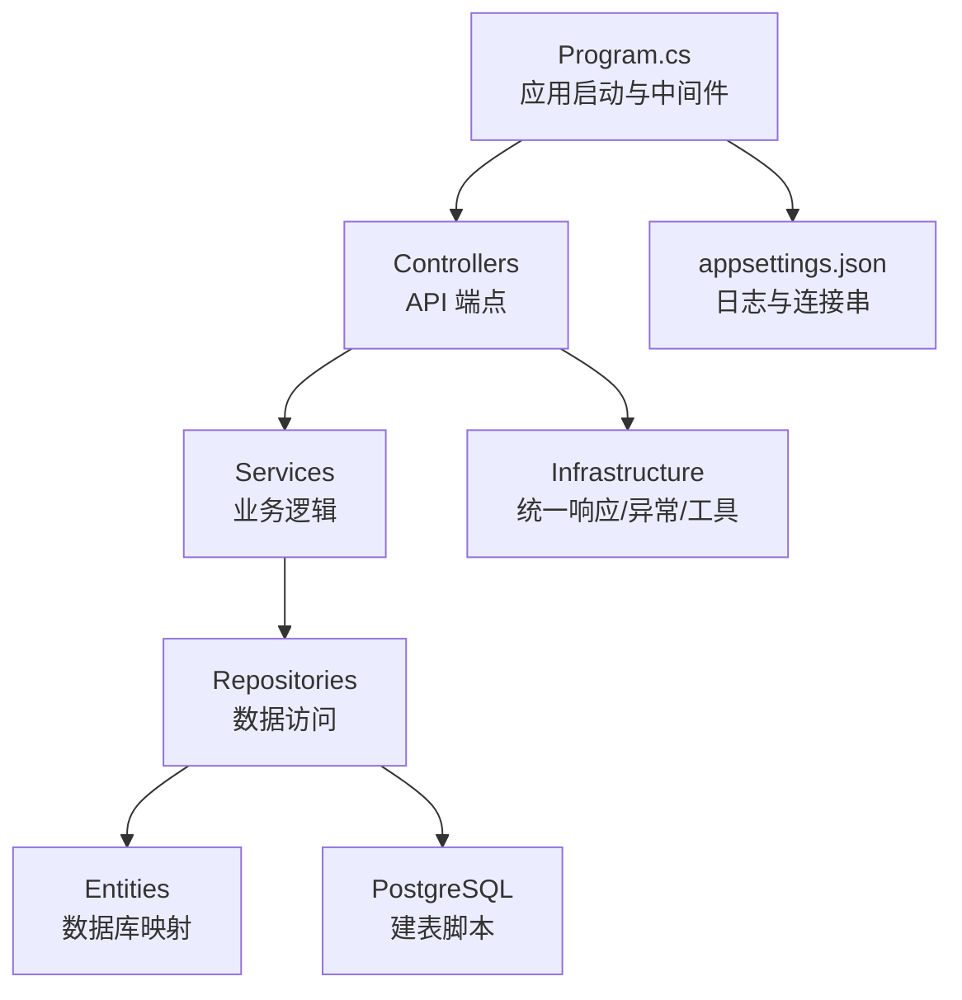
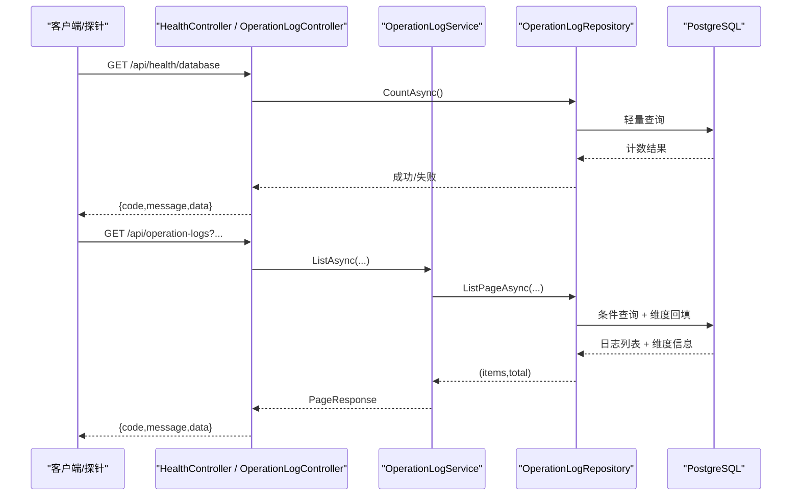
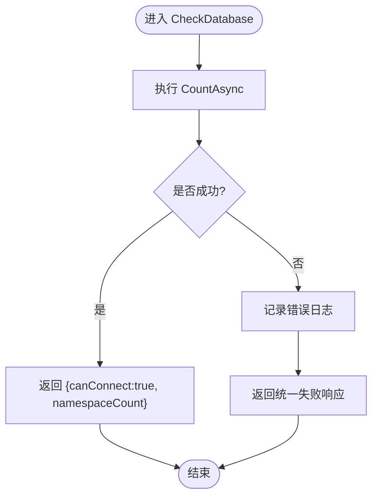
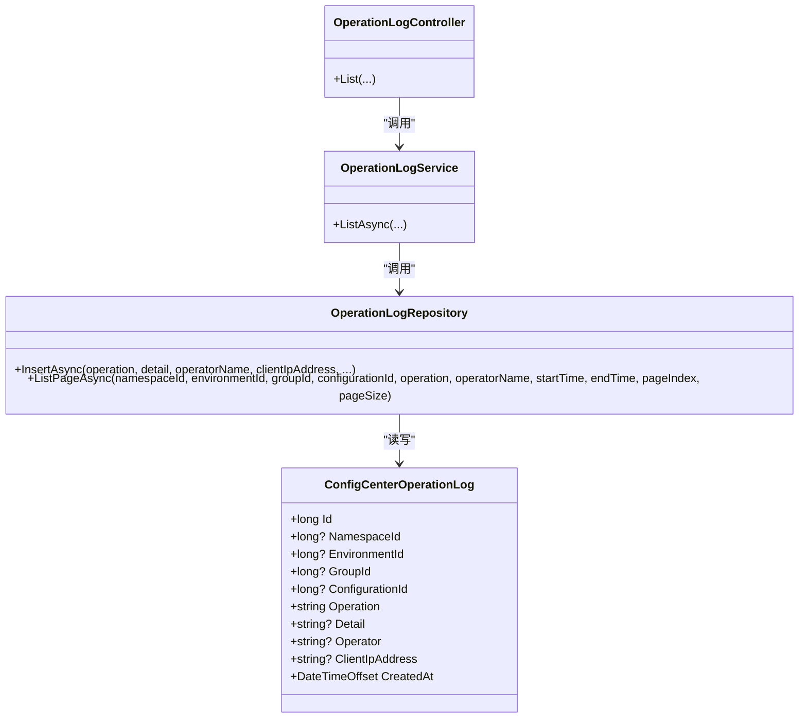
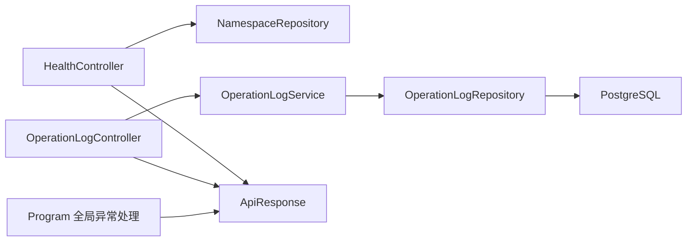

# 监控运维

<cite>
**本文引用的文件**
- [HealthController.cs](file://k_config_center/src/Controllers/HealthController.cs)
- [OperationLogController.cs](file://k_config_center/src/Controllers/OperationLogController.cs)
- [OperationLogService.cs](file://k_config_center/src/Services/OperationLogService.cs)
- [OperationLogRepository.cs](file://k_config_center/src/Repositories/OperationLogRepository.cs)
- [ConfigCenterOperationLog.cs](file://k_config_center/src/Entities/ConfigCenterOperationLog.cs)
- [CommonResponses.cs](file://k_config_center/src/Models/Responses/CommonResponses.cs)
- [ApiResponse.cs](file://k_config_center/src/Infrastructure/ApiResponse.cs)
- [BusinessException.cs](file://k_config_center/src/Infrastructure/BusinessException.cs)
- [OperationHelper.cs](file://k_config_center/src/Infrastructure/OperationHelper.cs)
- [Program.cs](file://k_config_center/Program.cs)
- [appsettings.json](file://k_config_center/appsettings.json)
- [配置中心建表脚本.sql](file://docs/数据库脚本/配置中心建表脚本.sql)
</cite>

## 目录
1. [简介](#简介)
2. [项目结构](#项目结构)
3. [核心组件](#核心组件)
4. [架构总览](#架构总览)
5. [详细组件分析](#详细组件分析)
6. [依赖关系分析](#依赖关系分析)
7. [性能考虑](#性能考虑)
8. [故障排查指南](#故障排查指南)
9. [结论](#结论)
10. [附录](#附录)

## 简介
本文件面向运维与平台工程团队，系统化说明配置中心的监控与运维能力，覆盖健康检查、操作审计日志、性能指标采集建议、告警与通知策略、故障排查流程以及备份恢复与灾难恢复预案。内容基于仓库中已实现的健康检查接口、操作日志写入与查询、统一响应与异常处理、日志配置与数据库结构等代码与文档进行提炼与扩展，确保可落地执行。

## 项目结构
后端采用分层架构：控制器层暴露 HTTP API；服务层封装业务逻辑；仓储层负责数据访问；基础设施层提供统一响应、异常类型与工具方法；实体与模型用于领域数据表达；程序入口集中注册服务、中间件与路由。

图表来源
- [Program.cs:10-107](file://k_config_center/Program.cs#L10-L107)
- [appsettings.json:1-13](file://k_config_center/appsettings.json#L1-L13)
- [配置中心建表脚本.sql:1-303](file://docs/数据库脚本/配置中心建表脚本.sql#L1-L303)

章节来源
- [Program.cs:10-107](file://k_config_center/Program.cs#L10-L107)
- [appsettings.json:1-13](file://k_config_center/appsettings.json#L1-L13)

## 核心组件
- 健康检查：提供数据库连通性探测，便于外部探针（如 K8s Liveness/Readiness）判断服务可用性。
- 操作日志：记录关键操作的审计信息，支持多维度检索与分页，辅助问题回溯与合规审计。
- 统一响应与异常：HTTP 始终返回 200，业务错误通过 code/message 表达；非业务异常统一捕获并记录结构化日志。
- 日志配置：通过 appsettings.json 控制日志级别，结合全局异常中间件输出关键上下文。

章节来源
- [HealthController.cs:7-29](file://k_config_center/src/Controllers/HealthController.cs#L7-L29)
- [OperationLogController.cs:7-29](file://k_config_center/src/Controllers/OperationLogController.cs#L7-L29)
- [ApiResponse.cs:3-9](file://k_config_center/src/Infrastructure/ApiResponse.cs#L3-L9)
- [BusinessException.cs:1-10](file://k_config_center/src/Infrastructure/BusinessException.cs#L1-L10)
- [Program.cs:71-92](file://k_config_center/Program.cs#L71-L92)
- [appsettings.json:1-13](file://k_config_center/appsettings.json#L1-L13)

## 架构总览
下图展示健康检查与操作日志在请求链路中的位置与交互，体现从控制器到仓储再到数据库的调用路径，以及统一异常处理对可观测性的贡献。

图表来源
- [HealthController.cs:11-29](file://k_config_center/src/Controllers/HealthController.cs#L11-L29)
- [OperationLogController.cs:12-29](file://k_config_center/src/Controllers/OperationLogController.cs#L12-L29)
- [OperationLogService.cs:10-18](file://k_config_center/src/Services/OperationLogService.cs#L10-L18)
- [OperationLogRepository.cs:31-84](file://k_config_center/src/Repositories/OperationLogRepository.cs#L31-L84)

## 详细组件分析

### 健康检查接口
- 目标：验证数据库连通性与基础映射可用，供外部系统判定服务健康。
- 行为：执行一次轻量 Count 查询；成功返回 canConnect=true 及命名空间数量；失败记录服务端错误日志并返回统一失败响应。
- 使用方式：
  - 探针定时调用 GET /api/health/database。
  - 若连续失败达到阈值，触发重启或摘除流量。
- 注意事项：
  - 健康检查仅检测数据库连通性，不校验业务状态。
  - 失败时对外返回统一错误码，避免泄露内部细节。

图表来源
- [HealthController.cs:17-29](file://k_config_center/src/Controllers/HealthController.cs#L17-L29)

章节来源
- [HealthController.cs:7-29](file://k_config_center/src/Controllers/HealthController.cs#L7-L29)
- [ApiResponse.cs:3-9](file://k_config_center/src/Infrastructure/ApiResponse.cs#L3-L9)

### 操作日志收集、存储与分析
- 收集范围：创建、更新、发布、回滚、下线、删除等关键操作。
- 存储格式：
  - 表：config_center_operation_log
  - 字段：id、namespace_id、environment_id、group_id、configuration_id、operation、detail(jsonb)、operator、client_ip_address、created_at
  - 索引：按 configuration_id 与 created_at 降序优化查询
- 写入策略：
  - 由业务 Service 调用 OperationLogRepository.InsertAsync 写入，detail 序列化为 JSONB。
  - 使用原生 SQL 并对 jsonb 与可空 bigint 参数显式 CAST，规避驱动类型推断问题。
  - 在事务内调用则随事务同生共死，保证一致性。
- 查询策略：
  - 支持多维度可选过滤（命名空间、环境、配置组、配置项、操作类型、操作人模糊匹配、时间区间闭开）。
  - 按 created_at 倒序分页。
  - 维度回填：历史日志可能只记录下级维度 id，仓储层自下而上补齐上级 id，并批量带出 key/名称供展示。
- 分析建议：
  - 以 operation 为维度统计各操作频率与趋势。
  - 以 operator/client_ip_address 做来源追踪。
  - 以 time window 观察变更高峰与异常时段。
  - 结合 detail(JSONB) 提取关键字段进行二次分析（如变更前后差异）。

图表来源
- [ConfigCenterOperationLog.cs:5-40](file://k_config_center/src/Entities/ConfigCenterOperationLog.cs#L5-L40)
- [OperationLogRepository.cs:12-25](file://k_config_center/src/Repositories/OperationLogRepository.cs#L12-L25)
- [OperationLogRepository.cs:31-84](file://k_config_center/src/Repositories/OperationLogRepository.cs#L31-L84)
- [OperationLogService.cs:10-18](file://k_config_center/src/Services/OperationLogService.cs#L10-L18)
- [OperationLogController.cs:12-29](file://k_config_center/src/Controllers/OperationLogController.cs#L12-L29)

章节来源
- [OperationLogController.cs:7-29](file://k_config_center/src/Controllers/OperationLogController.cs#L7-L29)
- [OperationLogService.cs:6-18](file://k_config_center/src/Services/OperationLogService.cs#L6-L18)
- [OperationLogRepository.cs:8-25](file://k_config_center/src/Repositories/OperationLogRepository.cs#L8-L25)
- [OperationLogRepository.cs:27-84](file://k_config_center/src/Repositories/OperationLogRepository.cs#L27-L84)
- [ConfigCenterOperationLog.cs:5-40](file://k_config_center/src/Entities/ConfigCenterOperationLog.cs#L5-L40)
- [配置中心建表脚本.sql:227-257](file://docs/数据库脚本/配置中心建表脚本.sql#L227-L257)

### 性能监控指标定义与采集方案
当前仓库未内置专用性能指标采集器，建议基于现有能力构建如下指标体系：
- 响应时间：
  - 定义：每个 API 的请求耗时（毫秒）。
  - 采集：在中间件或过滤器中计算起止时间，记录到结构化日志或指标系统。
- 吞吐量：
  - 定义：单位时间内处理的请求数（QPS）。
  - 采集：基于请求计数与时间窗口聚合。
- 错误率：
  - 定义：业务失败（code≠0）与服务器内部错误（code=10000）占比。
  - 采集：基于统一响应 code 统计。
- 数据库健康：
  - 定义：健康检查接口成功率与延迟。
  - 采集：定期调用 /api/health/database 并记录结果。
- 操作日志写入延迟：
  - 定义：从业务动作发生到日志落库的时间差。
  - 采集：在 Service 层记录时间戳并与仓储写入完成时间对比。

实施建议：
- 将上述指标以结构化日志形式输出，配合日志采集系统（如 ELK/Loki）进行聚合与可视化。
- 对关键路径（发布、回滚、配置读取）增加耗时打点。
- 对高频接口设置采样策略，避免指标噪声过大。

[本节为通用指导，不直接分析具体文件]

### 告警规则配置与通知机制
基于现有统一响应与异常处理，建议如下告警策略：
- 健康检查失败：
  - 规则：连续 N 次 /api/health/database 失败或延迟超过阈值。
  - 通知：邮件/IM/短信，持续升级。
- 高错误率：
  - 规则：单位时间内 code=10000 或业务错误码比例超过阈值。
  - 通知：即时告警，附带最近错误样本。
- 操作审计异常：
  - 规则：敏感操作（如 PUBLISH/ROLLBACK/DELETE）在非工作时间或非常规操作人出现。
  - 通知：安全告警通道。
- 数据库连接异常：
  - 规则：连接失败或慢查询增多。
  - 通知：DBA 与平台团队。

通知渠道：
- 企业微信/钉钉机器人、邮件、短信、电话（严重级别）。
- 告警收敛与去重：同一根因在窗口期内合并，避免风暴。

[本节为通用指导，不直接分析具体文件]

### 故障排查流程与常见问题诊断
- 健康检查失败：
  - 检查数据库连接串与网络可达性。
  - 查看健康检查失败时的服务端错误日志。
  - 确认数据库实例状态与权限。
- 操作日志缺失：
  - 确认业务 Service 是否正确调用 OperationLogRepository.InsertAsync。
  - 检查 detail 序列化与 JSONB 写入是否成功。
  - 核对时间区间与过滤条件是否过严导致查询为空。
- 查询缓慢：
  - 关注 created_at 与 configuration_id 索引命中情况。
  - 减少不必要的大页大小与复杂过滤组合。
  - 对历史大表考虑分区或归档。
- 统一错误码 10000：
  - 查看 Program 全局异常中间件记录的未处理异常日志。
  - 定位堆栈与请求上下文，修复后复测。

章节来源
- [Program.cs:71-92](file://k_config_center/Program.cs#L71-L92)
- [OperationLogRepository.cs:12-25](file://k_config_center/src/Repositories/OperationLogRepository.cs#L12-L25)
- [OperationLogRepository.cs:27-84](file://k_config_center/src/Repositories/OperationLogRepository.cs#L27-L84)
- [配置中心建表脚本.sql:227-257](file://docs/数据库脚本/配置中心建表脚本.sql#L227-L257)

### 备份恢复策略与灾难恢复预案
- 备份策略：
  - 全量备份：每日一次，保留至少 30 天。
  - 增量备份：每小时一次，保留至少 7 天。
  - 异地容灾：跨机房/跨区域复制。
  - 备份校验：定期恢复演练，验证完整性与可恢复性。
- 恢复策略：
  - 单表恢复：针对误删或损坏表进行时间点恢复。
  - 全库恢复：灾难场景下按 RTO/RPO 目标恢复。
  - 版本快照：利用配置版本表进行配置级回滚。
- 灾难恢复预案：
  - 明确 RTO/RPO 目标与责任人。
  - 制定切换流程与回滚流程。
  - 定期演练与复盘。

[本节为通用指导，不直接分析具体文件]

## 依赖关系分析
健康检查与操作日志的关键依赖如下：
- HealthController 依赖 NamespaceRepository 进行轻量查询。
- OperationLogController 依赖 OperationLogService，后者依赖 OperationLogRepository。
- OperationLogRepository 依赖 ISqlSugarClient 与 PostgreSQL。
- 统一响应与异常贯穿所有接口，保障对外契约一致。

图表来源
- [HealthController.cs:11-29](file://k_config_center/src/Controllers/HealthController.cs#L11-L29)
- [OperationLogController.cs:12-29](file://k_config_center/src/Controllers/OperationLogController.cs#L12-L29)
- [OperationLogService.cs:10-18](file://k_config_center/src/Services/OperationLogService.cs#L10-L18)
- [OperationLogRepository.cs:10-25](file://k_config_center/src/Repositories/OperationLogRepository.cs#L10-L25)
- [ApiResponse.cs:3-9](file://k_config_center/src/Infrastructure/ApiResponse.cs#L3-L9)
- [Program.cs:71-92](file://k_config_center/Program.cs#L71-L92)

章节来源
- [HealthController.cs:11-29](file://k_config_center/src/Controllers/HealthController.cs#L11-L29)
- [OperationLogController.cs:12-29](file://k_config_center/src/Controllers/OperationLogController.cs#L12-L29)
- [OperationLogService.cs:10-18](file://k_config_center/src/Services/OperationLogService.cs#L10-L18)
- [OperationLogRepository.cs:10-25](file://k_config_center/src/Repositories/OperationLogRepository.cs#L10-L25)
- [ApiResponse.cs:3-9](file://k_config_center/src/Infrastructure/ApiResponse.cs#L3-L9)
- [Program.cs:71-92](file://k_config_center/Program.cs#L71-L92)

## 性能考虑
- 健康检查应轻量：仅执行最小化查询，避免影响探针稳定性。
- 操作日志写入：
  - 使用原生 SQL 与显式类型转换，减少驱动开销。
  - 在高并发场景考虑异步写入或批处理，降低主流程阻塞。
- 查询优化：
  - 合理使用分页与过滤条件，避免全表扫描。
  - 利用 created_at 与 configuration_id 索引提升检索效率。
- 指标采集：
  - 对关键路径添加耗时打点，避免过度采样。
  - 将指标输出为结构化日志，便于后续聚合。

[本节为通用指导，不直接分析具体文件]

## 故障排查指南
- 健康检查失败：
  - 检查数据库连接串与网络连通性。
  - 查看健康检查失败时的服务端错误日志。
- 操作日志无法查询：
  - 确认时间区间与过滤条件。
  - 检查维度回填逻辑与关联表数据是否存在。
- 高错误率：
  - 查看全局异常中间件记录的结构化日志。
  - 定位具体接口与参数，复现并修复。
- 慢查询：
  - 分析 SQL 执行计划与索引使用情况。
  - 调整查询条件与分页大小。

章节来源
- [Program.cs:71-92](file://k_config_center/Program.cs#L71-L92)
- [OperationLogRepository.cs:27-84](file://k_config_center/src/Repositories/OperationLogRepository.cs#L27-L84)
- [HealthController.cs:17-29](file://k_config_center/src/Controllers/HealthController.cs#L17-L29)

## 结论
本项目已具备基础的健康检查与操作审计能力，并通过统一响应与异常处理保障了对外契约的一致性与可观测性。建议在此基础上完善性能指标采集、告警与通知机制，并结合数据库备份与恢复策略形成完整的监控运维闭环，以提升系统的稳定性与可维护性。

[本节为总结性内容，不直接分析具体文件]

## 附录

### 健康检查接口规范
- 路径：GET /api/health/database
- 成功响应：data 包含 canConnect 与 namespaceCount
- 失败响应：统一失败结构，code 表示错误类型，message 描述原因

章节来源
- [HealthController.cs:13-29](file://k_config_center/src/Controllers/HealthController.cs#L13-L29)
- [ApiResponse.cs:3-9](file://k_config_center/src/Infrastructure/ApiResponse.cs#L3-L9)

### 操作日志查询接口规范
- 路径：GET /api/operation-logs
- 参数：namespaceId、environmentId、groupId、configurationId、operation、operator、startTime、endTime、pageIndex、pageSize
- 响应：data 为分页结构 { items, total }，items 为 OperationLogResponse 列表

章节来源
- [OperationLogController.cs:12-29](file://k_config_center/src/Controllers/OperationLogController.cs#L12-L29)
- [CommonResponses.cs:23-51](file://k_config_center/src/Models/Responses/CommonResponses.cs#L23-L51)

### 日志配置与异常处理
- 日志级别：通过 appsettings.json 配置默认与框架日志级别
- 异常处理：全局中间件捕获 BusinessException 与非业务异常，记录结构化日志并返回统一响应

章节来源
- [appsettings.json:1-13](file://k_config_center/appsettings.json#L1-L13)
- [Program.cs:71-92](file://k_config_center/Program.cs#L71-L92)

### 数据库结构与索引
- 操作日志表：config_center_operation_log
- 索引：index_operation_log_configuration(configuration_id, created_at DESC)

章节来源
- [配置中心建表脚本.sql:227-257](file://docs/数据库脚本/配置中心建表脚本.sql#L227-L257)