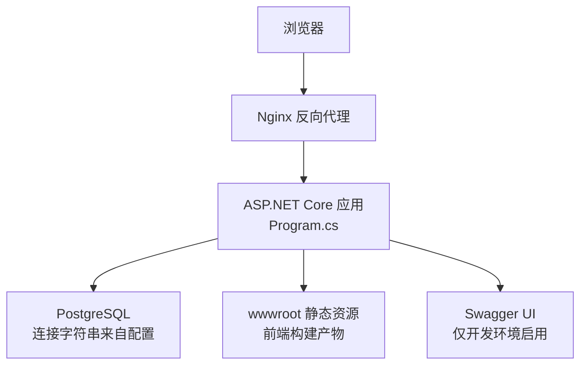
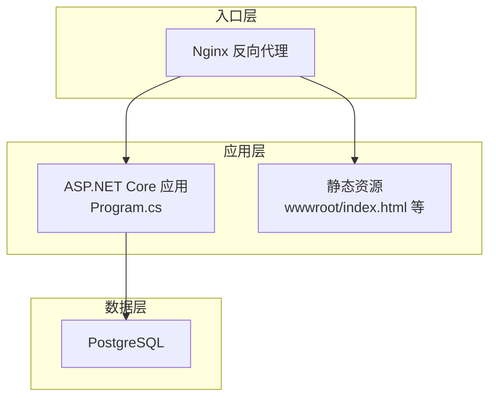
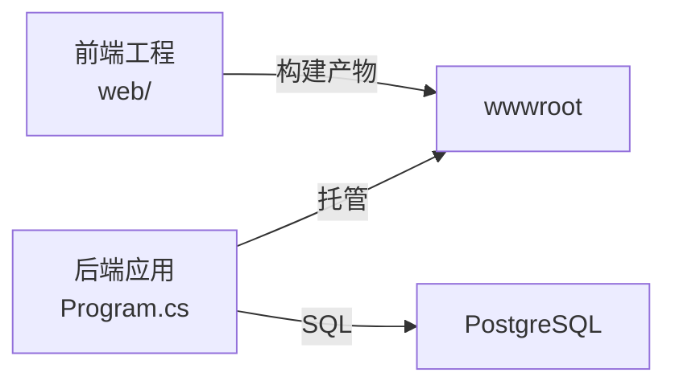

# 部署指南

<cite>
**本文引用的文件**
- [Program.cs](file://k_config_center/Program.cs)
- [appsettings.json](file://k_config_center/appsettings.json)
- [k_config_center.csproj](file://k_config_center/k_config_center.csproj)
- [vite.config.ts](file://web/vite.config.ts)
- [package.json](file://web/package.json)
- [后端方案.md](file://docs/技术方案/后端方案.md)
- [前端方案.md](file://docs/技术方案/前端方案.md)
- [配置中心建表脚本.sql](file://docs/数据库脚本/配置中心建表脚本.sql)
</cite>

## 目录
1. [简介](#简介)
2. [项目结构](#项目结构)
3. [核心组件](#核心组件)
4. [架构总览](#架构总览)
5. [详细组件分析](#详细组件分析)
6. [依赖关系分析](#依赖关系分析)
7. [性能考虑](#性能考虑)
8. [故障排查指南](#故障排查指南)
9. [结论](#结论)
10. [附录](#附录)

## 简介
本指南面向生产环境，提供该配置中心项目的完整容器化与编排部署方案。内容覆盖：
- Docker 镜像构建（后端 .NET + 静态前端产物）
- Kubernetes 资源清单（Deployment、Service、ConfigMap、Secret）
- 前后端分离的部署拓扑与负载均衡策略
- Nginx 反向代理与静态资源托管
- CI/CD 流水线示例与自动化发布流程
- 生产环境性能调优与安全加固建议

## 项目结构
该项目采用“单一应用托管”模式：前端通过 Vite 构建输出到后端的 wwwroot 目录，由 ASP.NET Core 统一托管静态资源并提供 SPA 路由兜底；API 统一以 /api 前缀暴露。

**图示来源**
- [Program.cs:61-107](file://k_config_center/Program.cs#L61-L107)
- [vite.config.ts:22-25](file://web/vite.config.ts#L22-L25)
- [appsettings.json:9-11](file://k_config_center/appsettings.json#L9-L11)

**章节来源**
- [Program.cs:61-107](file://k_config_center/Program.cs#L61-L107)
- [vite.config.ts:1-27](file://web/vite.config.ts#L1-L27)
- [appsettings.json:1-13](file://k_config_center/appsettings.json#L1-L13)

## 核心组件
- 后端服务：基于 ASP.NET Core Web API，注册控制器、数据访问与服务层，启用全局异常处理、HTTPS 重定向、静态文件托管与 SPA 路由兜底。
- 前端工程：React + TypeScript + Ant Design，使用 Vite 构建并输出至后端 wwwroot，开发期通过代理转发 /api 请求。
- 数据库：PostgreSQL，通过连接字符串注入，DDL 由 SQL 脚本管理。

关键要点
- 静态资源托管与 SPA 兜底：UseStaticFiles 托管 wwwroot，MapFallbackToFile 将未知前端路由回落到 index.html；/api 前缀不参与兜底，未知 API 返回 404。
- 开发环境 Swagger：仅在 Development 环境启用 /swagger。
- 连接配置：PostgreSQL 连接字符串位于 appsettings.json，需通过环境变量或 Secret 替换占位符。

**章节来源**
- [Program.cs:10-107](file://k_config_center/Program.cs#L10-L107)
- [后端方案.md:18-26](file://docs/技术方案/后端方案.md#L18-L26)
- [前端方案.md:266-294](file://docs/技术方案/前端方案.md#L266-L294)
- [配置中心建表脚本.sql:1-14](file://docs/数据库脚本/配置中心建表脚本.sql#L1-L14)

## 架构总览
下图展示生产部署拓扑：外部流量经 Nginx 进入，按路径分流到后端 API 与静态资源；后端通过连接字符串访问 PostgreSQL。

**图示来源**
- [Program.cs:94-105](file://k_config_center/Program.cs#L94-L105)
- [vite.config.ts:22-25](file://web/vite.config.ts#L22-L25)
- [appsettings.json:9-11](file://k_config_center/appsettings.json#L9-L11)

## 详细组件分析

### 容器化与镜像构建
- 后端镜像：基于 .NET SDK/Runtime 构建，编译生成可执行文件，复制前端构建产物到 wwwroot，暴露端口并运行。
- 前端构建：在 CI 中执行 npm run build，输出到 k_config_center/wwwroot，以便被后端统一托管。
- 多阶段构建建议：第一阶段使用 SDK 安装依赖并构建；第二阶段使用 Runtime 镜像运行，减小镜像体积。

注意事项
- 确保构建时设置正确的目标环境与连接配置（通过环境变量注入）。
- 若使用私有镜像仓库，需在 CI 中完成登录与推送。

**章节来源**
- [vite.config.ts:22-25](file://web/vite.config.ts#L22-L25)
- [package.json:6-10](file://web/package.json#L6-L10)
- [k_config_center.csproj:1-21](file://k_config_center/k_config_center.csproj#L1-L21)

### Kubernetes 部署清单
- Deployment
  - 副本数：根据负载设定（默认 2 起），开启滚动更新。
  - 健康检查：HTTP 探针指向 /health（如未实现，可使用 TCP 或自定义端点）。
  - 资源限制：为 CPU/Memory 设置 requests/limits，避免节点过载。
  - 环境变量：注入数据库连接串、日志级别、允许主机等。
- Service
  - ClusterIP 类型，暴露后端端口供 Ingress/Nginx 使用。
- ConfigMap
  - 存放非敏感配置（如 AllowedHosts、日志级别）。
- Secret
  - 存放数据库连接串、用户名密码等敏感信息，挂载为环境变量或卷。

最佳实践
- 使用命名空间隔离不同环境（dev/test/staging/prod）。
- 通过 Kustomize 或 Helm 管理多环境差异。
- 使用 PodDisruptionBudget 保障滚动更新期间的可用性。

**章节来源**
- [appsettings.json:1-13](file://k_config_center/appsettings.json#L1-L13)
- [Program.cs:10-107](file://k_config_center/Program.cs#L10-L107)

### 前后端分离部署拓扑与负载均衡
- 单应用托管模式：前端静态资源由后端托管，减少跨域与路由复杂度。
- 负载均衡：Kubernetes Service 对后端 Pod 进行轮询；Ingress/Nginx 对外暴露统一域名。
- 会话亲和：如无状态设计，无需 sticky session；如需，可在 Ingress 层配置。

**章节来源**
- [Program.cs:94-105](file://k_config_center/Program.cs#L94-L105)
- [前端方案.md:266-294](file://docs/技术方案/前端方案.md#L266-L294)

### Nginx 反向代理与静态资源托管
- 域名与 HTTPS：配置证书与强制 HTTPS 重定向。
- 路径分流：
  - /api/* 转发到后端 Service 端口。
  - 其他路径直接提供静态资源（index.html 等）。
- SPA 路由：Nginx 对前端路由进行 fallback 到 index.html，由前端路由接管。
- 缓存与压缩：启用 gzip/brotli，合理设置静态资源缓存头。

参考行为
- 后端已启用 UseHttpsRedirection 与静态资源托管，Nginx 负责终止 TLS 与路径分发。

**章节来源**
- [Program.cs:94-105](file://k_config_center/Program.cs#L94-L105)

### CI/CD 流水线与自动化部署
推荐步骤
- 代码提交触发流水线。
- 构建前端：npm ci → npm run build（输出到 wwwroot）。
- 构建后端：dotnet restore/build/publish。
- 打包镜像：多阶段构建，推送至镜像仓库。
- 部署到集群：kubectl apply 或 Helm upgrade，自动滚动更新。
- 健康检查与回滚：部署后验证健康端点，失败自动回滚。

可选增强
- 制品归档：保存构建产物与测试报告。
- 安全扫描：镜像漏洞扫描与依赖审计。
- 灰度发布：基于 Ingress 权重或金丝雀发布。

**章节来源**
- [package.json:6-10](file://web/package.json#L6-L10)
- [k_config_center.csproj:1-21](file://k_config_center/k_config_center.csproj#L1-L21)

### 生产环境性能调优参数
- 应用层
  - 调整最大并发请求与线程池大小（结合工作负载与硬件）。
  - 启用响应压缩与静态资源缓存。
  - 合理设置超时与重试策略（客户端侧）。
- 数据库层
  - 连接池大小、查询超时、索引优化（已有部分唯一索引与复合索引）。
  - 定期维护与统计信息更新。
- 系统层
  - 限制 Pod 资源（requests/limits），避免争用。
  - 使用本地 SSD 或高性能磁盘（如需要临时文件）。

**章节来源**
- [配置中心建表脚本.sql:161-185](file://docs/数据库脚本/配置中心建表脚本.sql#L161-L185)
- [后端方案.md:157-182](file://docs/技术方案/后端方案.md#L157-L182)

### 安全加固措施
- 传输安全
  - 全站 HTTPS，禁用弱加密套件。
  - HSTS、CSP、X-Frame-Options 等安全头。
- 认证与授权
  - 接入统一身份认证（如 OIDC/SAML），限制管理端访问。
  - 接口鉴权与最小权限原则。
- 配置与密钥
  - 使用 Secret 管理敏感信息，禁止硬编码。
  - 最小化暴露面（关闭 Swagger 在生产环境）。
- 审计与监控
  - 操作日志与访问日志集中收集。
  - 告警规则覆盖错误率、延迟与资源使用。

**章节来源**
- [Program.cs:36-69](file://k_config_center/Program.cs#L36-L69)
- [后端方案.md:597-603](file://docs/技术方案/后端方案.md#L597-L603)

## 依赖关系分析
- 运行时依赖
  - .NET 运行时（Runtime）用于执行后端应用。
  - PostgreSQL 作为持久化存储。
- 构建依赖
  - Node.js 与 npm/yarn 用于前端构建。
  - .NET SDK 用于后端构建与发布。
- 组件耦合
  - 前端通过 /api 与后端通信，构建产物由后端托管。
  - 后端通过连接字符串访问数据库，无强耦合的外部服务。

**图示来源**
- [vite.config.ts:22-25](file://web/vite.config.ts#L22-L25)
- [Program.cs:94-105](file://k_config_center/Program.cs#L94-L105)
- [appsettings.json:9-11](file://k_config_center/appsettings.json#L9-L11)

**章节来源**
- [vite.config.ts:1-27](file://web/vite.config.ts#L1-L27)
- [Program.cs:10-107](file://k_config_center/Program.cs#L10-L107)
- [appsettings.json:1-13](file://k_config_center/appsettings.json#L1-L13)

## 性能考虑
- 水平扩展：无状态后端可通过增加副本提升吞吐。
- 缓存策略：静态资源长缓存，API 响应按需缓存。
- 数据库优化：利用现有索引与连接池，避免全表扫描。
- 资源配额：为 Pod 设置合理的 CPU/Memory 限制，防止抖动。

[本节为通用指导，不直接分析具体文件]

## 故障排查指南
常见问题与定位
- 无法访问静态资源：确认 Nginx 是否正确转发静态路径，后端是否启用 UseStaticFiles。
- SPA 路由 404：确认 MapFallbackToFile 与 Nginx 的 fallback 配置。
- 数据库连接失败：检查连接字符串、网络连通性与凭据。
- 接口报错：查看全局异常中间件记录的日志与统一响应码。

建议步骤
- 检查 Pod 日志与事件。
- 验证健康检查端点与探针。
- 逐步缩小问题范围（Nginx → 后端 → 数据库）。

**章节来源**
- [Program.cs:71-92](file://k_config_center/Program.cs#L71-L92)
- [Program.cs:94-105](file://k_config_center/Program.cs#L94-L105)

## 结论
本项目采用前后端一体化托管的简化部署模式，配合 Nginx 反向代理与 Kubernetes 编排，可实现高可用、易扩展的生产部署。通过 CI/CD 自动化流水线与严格的安全加固，能够稳定支撑配置中心的日常管理与客户端读取需求。

[本节为总结性内容，不直接分析具体文件]

## 附录

### 部署清单模板要点（文字说明）
- Deployment
  - replicas: 2+
  - strategy: RollingUpdate
  - liveness/readiness probes: HTTP/TCP
  - resources: requests/limits
  - env: 从 Secret/ConfigMap 注入
- Service
  - type: ClusterIP
  - ports: 后端端口映射
- ConfigMap
  - 非敏感配置键值对
- Secret
  - 数据库连接串、用户名、密码

[本节为概念性说明，不直接分析具体文件]

### 数据库初始化
- 执行建表脚本创建表结构与索引。
- 初始化默认数据（如内置命名空间）。

**章节来源**
- [配置中心建表脚本.sql:1-14](file://docs/数据库脚本/配置中心建表脚本.sql#L1-L14)
- [配置中心建表脚本.sql:299-303](file://docs/数据库脚本/配置中心建表脚本.sql#L299-L303)