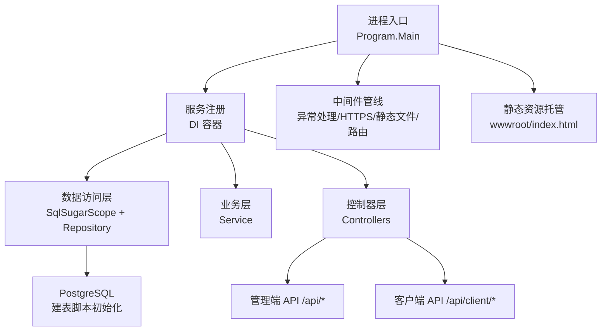
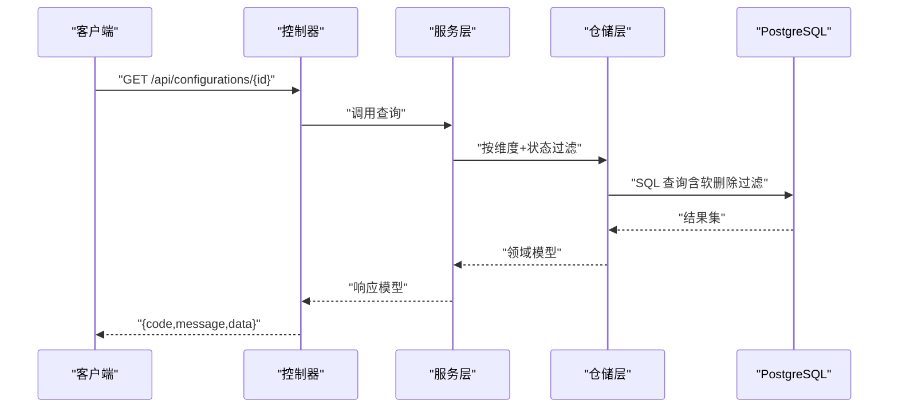
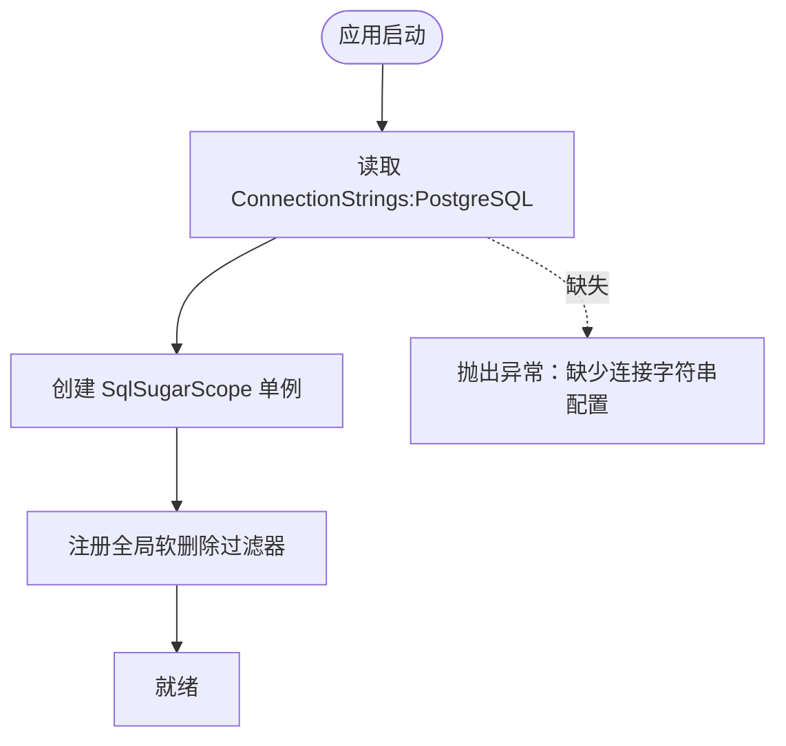
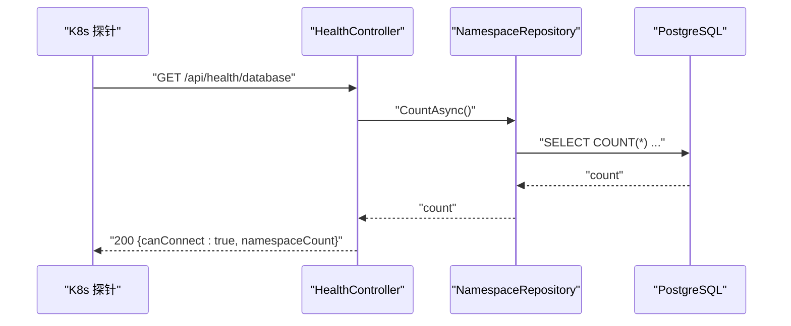
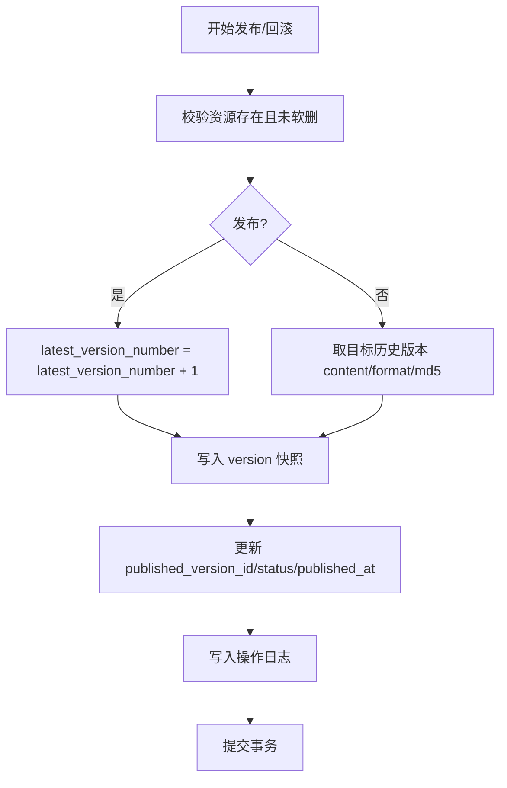
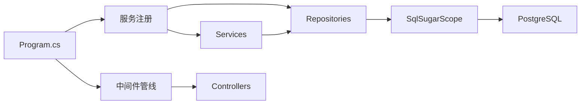

# 部署运维

<cite>
**本文引用的文件**
- [Program.cs](file://k_config_center/Program.cs)
- [appsettings.json](file://k_config_center/appsettings.json)
- [k_config_center.csproj](file://k_config_center/k_config_center.csproj)
- [SqlSugarSetup.cs](file://k_config_center/src/Infrastructure/SqlSugarSetup.cs)
- [HealthController.cs](file://k_config_center/src/Controllers/HealthController.cs)
- [配置中心建表脚本.sql](file://docs/数据库脚本/配置中心建表脚本.sql)
- [后端方案.md](file://docs/技术方案/后端方案.md)
- [配置中心设计文档.md](file://docs/设计文档/配置中心设计文档.md)
- [launchSettings.json](file://k_config_center/Properties/launchSettings.json)
</cite>

## 目录
1. [简介](#简介)
2. [项目结构](#项目结构)
3. [核心组件](#核心组件)
4. [架构总览](#架构总览)
5. [详细组件分析](#详细组件分析)
6. [依赖关系分析](#依赖关系分析)
7. [性能与容量规划](#性能与容量规划)
8. [监控、日志与健康检查](#监控日志与健康检查)
9. [安全与合规](#安全与合规)
10. [容器化与编排（Docker/Kubernetes）](#容器化与编排dockerkubernetes)
11. [备份与恢复、灾难恢复](#备份与恢复灾难恢复)
12. [故障排查指南](#故障排查指南)
13. [结论](#结论)
14. [附录：环境变量与配置项清单](#附录环境变量与配置项清单)

## 简介
本指南面向生产环境的部署与运维，覆盖数据库连接、环境变量、安全配置、容器化与编排、性能调优、监控指标、日志收集、错误追踪、健康检查、备份恢复与灾难恢复策略。内容基于代码库中的实际实现与约定进行说明，确保可落地、可审计、可回滚。

## 项目结构
- 后端为 ASP.NET Core Web API，使用 SqlSugar 访问 PostgreSQL，提供管理端与客户端读取接口，并托管前端静态资源。
- 数据库 DDL 通过 SQL 脚本执行，实体仅做映射；全局软删除过滤器统一过滤已删除记录。
- 启动时注册服务、中间件、Swagger（仅开发环境）、静态资源托管与 SPA 路由兜底。

图表来源
- [Program.cs:10-107](file://k_config_center/Program.cs#L10-L107)
- [SqlSugarSetup.cs:12-39](file://k_config_center/src/Infrastructure/SqlSugarSetup.cs#L12-L39)
- [配置中心建表脚本.sql:1-303](file://docs/数据库脚本/配置中心建表脚本.sql#L1-L303)

章节来源
- [Program.cs:10-107](file://k_config_center/Program.cs#L10-L107)
- [k_config_center.csproj:1-21](file://k_config_center/k_config_center.csproj#L1-L21)
- [SqlSugarSetup.cs:12-39](file://k_config_center/src/Infrastructure/SqlSugarSetup.cs#L12-L39)
- [配置中心建表脚本.sql:1-303](file://docs/数据库脚本/配置中心建表脚本.sql#L1-L303)

## 核心组件
- 应用入口与中间件：统一异常处理、HTTPS 重定向、静态资源托管、SPA 路由兜底、Swagger（仅开发）。
- 数据访问：SqlSugarScope 单例，PostgreSQL 连接，全局软删除过滤器。
- 健康检查：/api/health/database 验证数据库连通性。
- 配置与运行：appsettings.json 提供日志级别、AllowedHosts、数据库连接字符串；launchSettings.json 用于本地调试端口与环境变量。

章节来源
- [Program.cs:10-107](file://k_config_center/Program.cs#L10-L107)
- [appsettings.json:1-13](file://k_config_center/appsettings.json#L1-L13)
- [SqlSugarSetup.cs:12-39](file://k_config_center/src/Infrastructure/SqlSugarSetup.cs#L12-L39)
- [HealthController.cs:1-31](file://k_config_center/src/Controllers/HealthController.cs#L1-L31)
- [launchSettings.json:1-24](file://k_config_center/Properties/launchSettings.json#L1-L24)

## 架构总览
系统采用分层架构：Controller → Service → Repository → SqlSugar → PostgreSQL。发布/回滚等事务型操作在 Repository 层通过事务编排器保证一致性。客户端只读接口仅返回已发布且未软删除的配置。

图表来源
- [Program.cs:10-107](file://k_config_center/Program.cs#L10-L107)
- [SqlSugarSetup.cs:12-39](file://k_config_center/src/Infrastructure/SqlSugarSetup.cs#L12-L39)
- [后端方案.md:86-120](file://docs/技术方案/后端方案.md#L86-L120)

## 详细组件分析

### 数据库连接与初始化
- 连接字符串键名：ConnectionStrings:PostgreSQL。
- 驱动与类型：Npgsql + SqlSugarCore，DbType.PostgreSQL。
- 建库方式：手工执行 SQL 脚本，禁用 CodeFirst；包含部分唯一索引、CHECK 约束、触发器与默认数据。
- 软删除：全局 QueryFilter 对四张主资源表生效，审计回溯场景用 ClearFilter 绕过。

图表来源
- [SqlSugarSetup.cs:12-39](file://k_config_center/src/Infrastructure/SqlSugarSetup.cs#L12-L39)
- [k_config_center.csproj:12-18](file://k_config_center/k_config_center.csproj#L12-L18)
- [配置中心建表脚本.sql:1-303](file://docs/数据库脚本/配置中心建表脚本.sql#L1-L303)

章节来源
- [SqlSugarSetup.cs:12-39](file://k_config_center/src/Infrastructure/SqlSugarSetup.cs#L12-L39)
- [k_config_center.csproj:12-18](file://k_config_center/k_config_center.csproj#L12-L18)
- [配置中心建表脚本.sql:1-303](file://docs/数据库脚本/配置中心建表脚本.sql#L1-L303)

### 健康检查
- 端点：GET /api/health/database
- 行为：执行轻量 Count 查询，成功返回 canConnect=true 与命名空间计数；失败记录服务端日志并返回业务失败码。

图表来源
- [HealthController.cs:1-31](file://k_config_center/src/Controllers/HealthController.cs#L1-L31)

章节来源
- [HealthController.cs:1-31](file://k_config_center/src/Controllers/HealthController.cs#L1-L31)

### 配置与运行参数
- appsettings.json：日志级别、AllowedHosts、数据库连接字符串。
- launchSettings.json：本地调试端口与环境变量（ASPNETCORE_ENVIRONMENT）。
- Program 中根据环境启用 Swagger UI（仅 Development）。

章节来源
- [appsettings.json:1-13](file://k_config_center/appsettings.json#L1-L13)
- [launchSettings.json:1-24](file://k_config_center/Properties/launchSettings.json#L1-L24)
- [Program.cs:36-69](file://k_config_center/Program.cs#L36-L69)

### 发布/回滚事务流程（概念）
- 发布：版本号自增 → 写入版本快照 → 更新生效指针 → 写审计日志（同一事务）。
- 回滚：以历史版本内容生成新版本，保持版本线性递增。

图表来源
- [后端方案.md:614-675](file://docs/技术方案/后端方案.md#L614-L675)
- [配置中心设计文档.md:181-214](file://docs/设计文档/配置中心设计文档.md#L181-L214)

## 依赖关系分析
- 运行时依赖：ASP.NET Core Web、Npgsql、SqlSugarCore、Swashbuckle.AspNetCore（仅开发）。
- 外部依赖：PostgreSQL 14+。
- 模块耦合：Controller 薄封装，Service 承载业务规则，Repository 唯一接触 ISqlSugarClient 与 Entities；发布/回滚通过 Repository 层事务编排器保证一致性。

图表来源
- [Program.cs:10-107](file://k_config_center/Program.cs#L10-L107)
- [SqlSugarSetup.cs:12-39](file://k_config_center/src/Infrastructure/SqlSugarSetup.cs#L12-L39)
- [k_config_center.csproj:12-18](file://k_config_center/k_config_center.csproj#L12-L18)

章节来源
- [k_config_center.csproj:12-18](file://k_config_center/k_config_center.csproj#L12-L18)
- [后端方案.md:86-120](file://docs/技术方案/后端方案.md#L86-L120)

## 性能与容量规划
- 数据库
  - 使用已有复合索引 index_configuration_namespace_environment(namespace_id, environment_id, status) 优化高频读取。
  - 利用部分唯一索引 WHERE deleted_at IS NULL 支持软删除后重建 key。
  - updated_at 由数据库触发器维护，避免应用层额外赋值开销。
- 应用
  - 长轮询变更探测基于 md5 对比，成本低；挂起期间避免阻塞线程池线程。
  - 列表查询支持多维度可选过滤，复用既有索引。
- 建议
  - 合理设置连接池大小与超时（由 Npgsql/SqlSugar 默认策略控制，结合压测调整）。
  - 针对高并发发布场景，依赖数据库行锁串行化版本号自增，避免并发冲突。

章节来源
- [配置中心建表脚本.sql:136-185](file://docs/数据库脚本/配置中心建表脚本.sql#L136-L185)
- [配置中心设计文档.md:207-214](file://docs/设计文档/配置中心设计文档.md#L207-L214)
- [后端方案.md:660-675](file://docs/技术方案/后端方案.md#L660-L675)

## 监控、日志与健康检查
- 健康检查
  - /api/health/database：验证数据库连通性与基础查询能力。
- 日志
  - 默认日志级别 Information；Microsoft.AspNetCore 为 Warning。
  - 未处理异常记录结构化日志（含 Method/Path），并返回统一 500 响应。
  - 审计日志：config_center_operation_log 记录关键操作详情（JSONB）。
- 指标
  - 建议采集 HTTP 请求量、延迟分布、错误率、数据库连接数与慢查询。
  - 可通过反向代理或应用指标导出器暴露 Prometheus 指标（按需扩展）。

章节来源
- [appsettings.json:1-13](file://k_config_center/appsettings.json#L1-L13)
- [Program.cs:71-92](file://k_config_center/Program.cs#L71-L92)
- [配置中心建表脚本.sql:227-257](file://docs/数据库脚本/配置中心建表脚本.sql#L227-L257)
- [后端方案.md:597-603](file://docs/技术方案/后端方案.md#L597-L603)

## 安全与合规
- 传输安全
  - 启用 HTTPS 重定向（UseHttpsRedirection）。
  - 生产环境关闭 Swagger UI，避免暴露接口文档。
- 访问控制
  - 通过反向代理/网关实施鉴权与限流；X-Operator 头用于审计记录操作人。
- 敏感信息
  - 数据库凭据通过环境变量注入，不硬编码到镜像或配置仓库。
- 最小权限
  - 数据库账户仅授予必要 DML/DDL（DDL 由脚本集中执行）。

章节来源
- [Program.cs:64-99](file://k_config_center/Program.cs#L64-L99)
- [后端方案.md:597-603](file://docs/技术方案/后端方案.md#L597-L603)

## 容器化与编排（Docker/Kubernetes）
- Docker 镜像
  - 使用官方 ASP.NET Core 运行时镜像构建多阶段镜像，输出 wwwroot 静态资源。
  - 暴露端口：默认 80（HTTP）与 443（HTTPS，视反向代理而定）。
  - 健康检查：容器内 curl /api/health/database。
- Kubernetes
  - Deployment：副本数、资源限制/请求、滚动更新策略。
  - Service：ClusterIP/NodePort/Ingress（推荐 Ingress 终止 TLS）。
  - ConfigMap/Secret：注入 appsettings.json 中的连接字符串与日志级别。
  - Probes：liveness/readiness 指向 /api/health/database。
  - 水平扩缩容：HPA 基于 CPU/内存或自定义指标。

提示
- 将数据库连接字符串放入 Secret，挂载为环境变量或配置文件。
- 通过 Ingress 暴露 /api 与前端静态资源，开启 HTTPS。

[本节为通用编排指导，不直接引用具体源码文件]

## 备份与恢复、灾难恢复
- 备份策略
  - 定期全量备份 + WAL 归档，保留周期满足合规要求。
  - 备份对象：PostgreSQL 数据库（含触发器、索引、约束、注释）。
- 恢复演练
  - 定期演练恢复到测试环境，验证数据一致性与应用可用性。
- 灾难恢复
  - 跨可用区/地域复制（如逻辑复制/物理备库），定义 RPO/RTO 目标。
  - 切换流程：DNS/Ingress 切换至新集群，通知客户端刷新配置。

[本节为通用灾备指导，不直接引用具体源码文件]

## 故障排查指南
- 无法连接数据库
  - 检查 ConnectionStrings:PostgreSQL 是否正确注入。
  - 查看健康检查 /api/health/database 返回与服务器日志。
- 接口返回 500
  - 查看全局异常处理记录的 Method/Path 与堆栈。
  - 确认是否触发了非业务异常（如网络/序列化）。
- 配置未生效
  - 确认状态为 PUBLISHED 且未软删除。
  - 客户端拉取路径：/api/client/configurations?namespaceKey=&environmentKey=&groupKey=。
- 发布并发冲突
  - 关注错误码 30004（发布并发冲突），重试即可。
- 审计追溯
  - 查询 config_center_operation_log，结合 operator、时间区间定位问题。

章节来源
- [HealthController.cs:1-31](file://k_config_center/src/Controllers/HealthController.cs#L1-L31)
- [Program.cs:71-92](file://k_config_center/Program.cs#L71-L92)
- [后端方案.md:482-496](file://docs/技术方案/后端方案.md#L482-L496)
- [配置中心设计文档.md:207-214](file://docs/设计文档/配置中心设计文档.md#L207-L214)

## 结论
本指南基于代码库的实际实现，给出了从数据库连接、环境变量、安全配置到容器化编排、性能调优、监控日志、健康检查、备份恢复与故障排查的完整运维方案。遵循“脚本化 DDL、全局软删除、统一异常与审计”的设计原则，可在生产环境中稳定运行并持续演进。

## 附录：环境变量与配置项清单
- 必需
  - ConnectionStrings:PostgreSQL：PostgreSQL 连接字符串（Host/Port/Database/Username/Password）。
  - ASPNETCORE_ENVIRONMENT：Development/Production（影响 Swagger 与日志级别）。
- 可选
  - Logging:LogLevel:*：调整日志级别（默认 Information）。
  - AllowedHosts：主机白名单（默认 *）。
- 建议
  - 通过反向代理强制 HTTPS。
  - 通过网关/Ingress 实施鉴权与限流。
  - 将敏感信息放入 Secret，避免进入镜像或仓库。

章节来源
- [appsettings.json:1-13](file://k_config_center/appsettings.json#L1-L13)
- [launchSettings.json:1-24](file://k_config_center/Properties/launchSettings.json#L1-L24)
- [Program.cs:64-99](file://k_config_center/Program.cs#L64-L99)