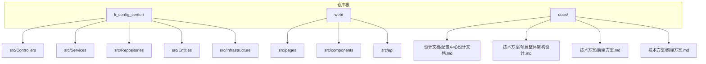
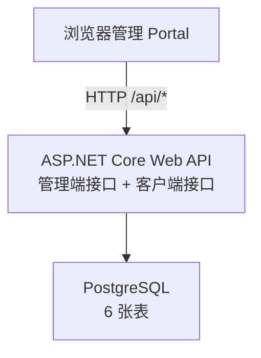
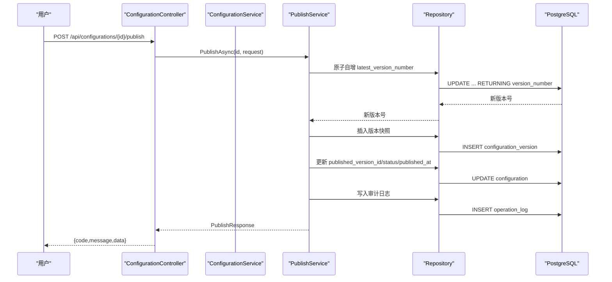
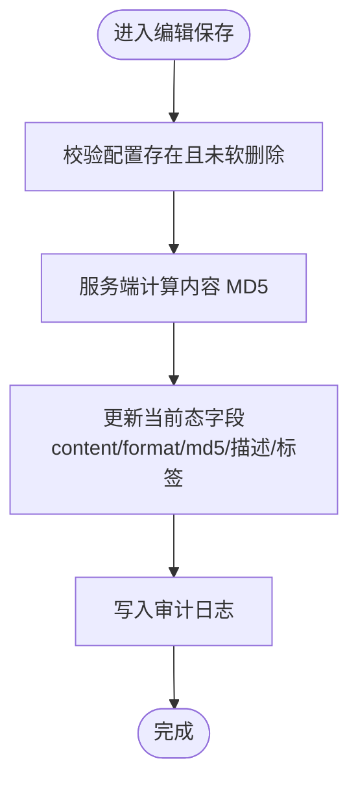
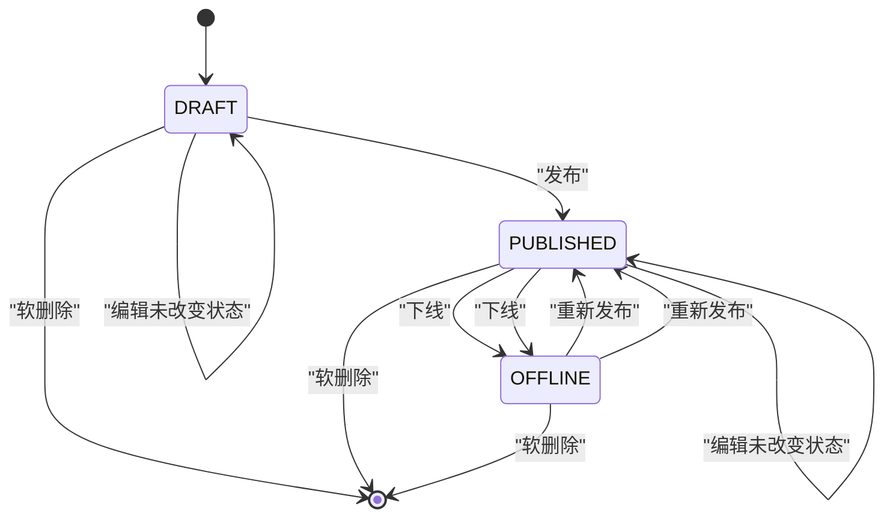
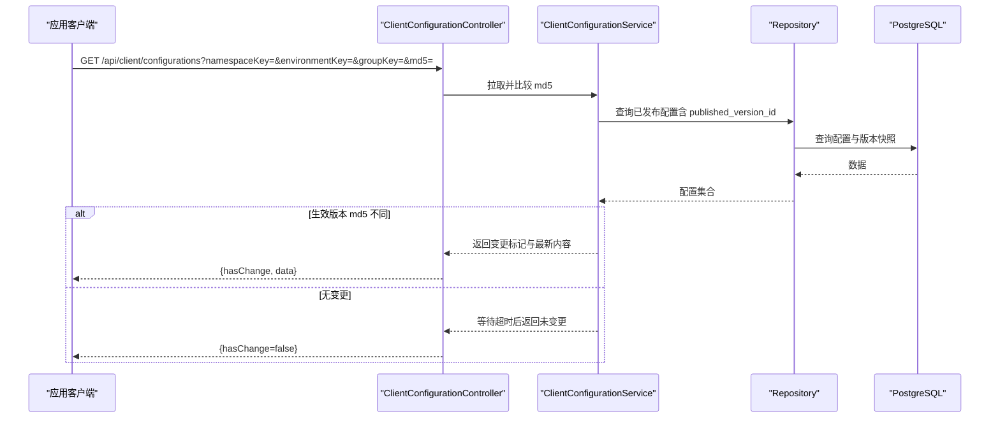
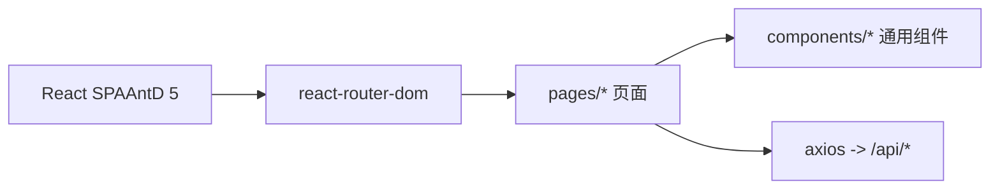
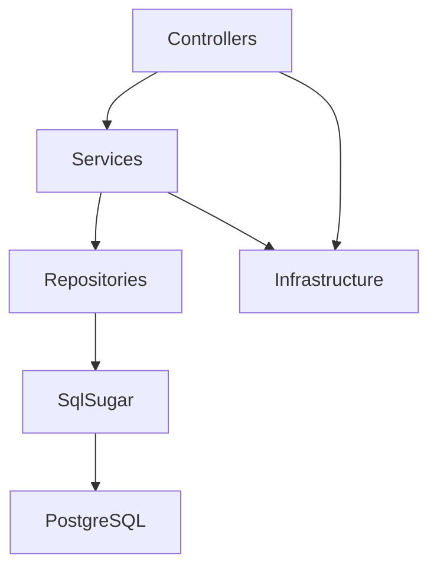

# 项目概述

<cite>
**本文引用的文件**
- [配置中心设计文档.md](file://docs/设计文档/配置中心设计文档.md)
- [项目整体架构设计.md](file://docs/技术方案/项目整体架构设计.md)
- [后端方案.md](file://docs/技术方案/后端方案.md)
- [前端方案.md](file://docs/技术方案/前端方案.md)
- [Program.cs](file://k_config_center/src/Program.cs)
- [ConfigurationController.cs](file://k_config_center/src/Controllers/ConfigurationController.cs)
- [ConfigurationService.cs](file://k_config_center/src/Services/ConfigurationService.cs)
- [appsettings.json](file://k_config_center/appsettings.json)
- [package.json](file://web/package.json)
</cite>

## 目录
1. [简介](#简介)
2. [项目结构](#项目结构)
3. [核心组件](#核心组件)
4. [架构总览](#架构总览)
5. [详细组件分析](#详细组件分析)
6. [依赖关系分析](#依赖关系分析)
7. [性能与可用性](#性能与可用性)
8. [故障排查指南](#故障排查指南)
9. [结论](#结论)
10. [附录：使用场景与用户故事](#附录使用场景与用户故事)

## 简介
本项目是一个自研配置中心，用于集中管理应用配置，替代散落在各应用中的配置文件与手工改库操作。其核心价值在于提供多环境隔离、版本快照、发布回滚、状态机与操作审计等能力，并通过前后端分离的 Web 界面完成日常维护，同时为未来接入的应用客户端提供读取与变更探测接口。

- 核心目标
  - 统一配置入口：命名空间 → 环境 → 配置组 → 配置项的层级模型，支持多业务线、多环境隔离。
  - 版本与快照：每次发布产生不可变的历史版本快照，版本号线性递增，支持回滚。
  - 状态机与软删除：DRAFT / PUBLISHED / OFFLINE 状态流转；全资源统一软删除策略。
  - 审计可追溯：所有写操作落审计日志，便于问题定位与合规审计。
  - 客户端读取：面向应用客户端提供已发布配置的读取与长轮询变更探测接口。

- 技术栈
  - 后端：ASP.NET Core Web API + SqlSugar（PostgreSQL）
  - 前端：React 18 + TypeScript + Ant Design 5 + Vite
  - 数据库：PostgreSQL 14+（部分唯一索引、JSONB、TIMESTAMPTZ 等特性）

**章节来源**
- [项目整体架构设计.md:9-18](file://docs/技术方案/项目整体架构设计.md#L9-L18)
- [项目整体架构设计.md:49-58](file://docs/技术方案/项目整体架构设计.md#L49-L58)
- [配置中心设计文档.md:10-19](file://docs/设计文档/配置中心设计文档.md#L10-L19)

## 项目结构
仓库采用“后端 + 前端 + 文档”的三域组织方式：
- k_config_center：后端 ASP.NET Core Web API，包含控制器、服务、仓储、实体、基础设施与配置。
- web：前端 React SPA，独立 Node 工程，构建产物输出到后端 wwwroot，实现单一应用部署。
- docs：设计文档、技术方案与数据库脚本。

**图表来源**
- [项目整体架构设计.md:60-70](file://docs/技术方案/项目整体架构设计.md#L60-L70)
- [后端方案.md:27-76](file://docs/技术方案/后端方案.md#L27-L76)
- [前端方案.md:53-118](file://docs/技术方案/前端方案.md#L53-L118)

**章节来源**
- [项目整体架构设计.md:60-70](file://docs/技术方案/项目整体架构设计.md#L60-L70)
- [后端方案.md:27-76](file://docs/技术方案/后端方案.md#L27-L76)
- [前端方案.md:53-118](file://docs/技术方案/前端方案.md#L53-L118)

## 核心组件
- 分层架构
  - 控制器层：接收请求、参数绑定、调用服务、返回统一响应。
  - 服务层：承载业务规则（状态机校验、md5 计算、未发布变更判断、事务编排）。
  - 仓储层：唯一接触 ORM 与数据库，封装查询/写入与实体映射。
  - 基础设施：统一响应、异常、Swagger 过滤器、SqlSugar 注册、工具方法。
- 关键领域对象
  - 命名空间、环境、配置组、配置项、版本快照、操作日志。
- 核心流程
  - 编辑保存（草稿）、发布（原子版本号 + 快照 + 指针切换）、回滚（以历史版本生成新版本）、下线（OFFLINE）、软删除（全资源统一）。

**章节来源**
- [后端方案.md:86-120](file://docs/技术方案/后端方案.md#L86-L120)
- [配置中心设计文档.md:181-232](file://docs/设计文档/配置中心设计文档.md#L181-L232)

## 架构总览
系统由浏览器管理门户、ASP.NET Core 单进程 API、PostgreSQL 组成。开发期双进程联调，部署期静态资源托管于后端，形成单一应用形态。

**图表来源**
- [项目整体架构设计.md:20-47](file://docs/技术方案/项目整体架构设计.md#L20-L47)

**章节来源**
- [项目整体架构设计.md:20-47](file://docs/技术方案/项目整体架构设计.md#L20-L47)

## 详细组件分析

### 配置项管理（编辑/详情/版本/发布/回滚/下线）
- 控制器职责：参数绑定、调用服务、包装统一响应。
- 服务职责：编辑保存（仅更新当前态字段，不产生版本）、列表附带“有未发布变更”标记、详情聚合生效版本、版本历史分页、单个版本快照。
- 发布/回滚：通过 PublishService 在事务内完成版本号自增、写快照、更新生效指针、写审计日志。

**图表来源**
- [ConfigurationController.cs:65-83](file://k_config_center/src/Controllers/ConfigurationController.cs#L65-L83)
- [后端方案.md:614-624](file://docs/技术方案/后端方案.md#L614-L624)
- [后端方案.md:626-633](file://docs/技术方案/后端方案.md#L626-L633)

**章节来源**
- [ConfigurationController.cs:8-114](file://k_config_center/src/Controllers/ConfigurationController.cs#L8-L114)
- [ConfigurationService.cs:9-108](file://k_config_center/src/Services/ConfigurationService.cs#L9-L108)
- [后端方案.md:608-633](file://docs/技术方案/后端方案.md#L608-L633)

### 配置项编辑与“未发布变更”判定
- 新建：写入当前态，status=DRAFT，latest_version_number=0，服务端计算 md5。
- 保存编辑：仅更新 content/format/md5/description/tags，不产生版本、不改 status。
- 未发布变更判定：当前 md5 与 published_version_id 指向版本的 md5 不一致或从未发布。

**图表来源**
- [ConfigurationService.cs:46-77](file://k_config_center/src/Services/ConfigurationService.cs#L46-L77)
- [后端方案.md:608-613](file://docs/技术方案/后端方案.md#L608-L613)

**章节来源**
- [ConfigurationService.cs:23-77](file://k_config_center/src/Services/ConfigurationService.cs#L23-L77)
- [后端方案.md:608-613](file://docs/技术方案/后端方案.md#L608-L613)

### 版本与发布机制（状态机）
- 状态机：DRAFT → PUBLISHED → OFFLINE；任意状态可软删除。
- 发布：原子版本号 +1 → 写快照 → 更新生效指针 → 写审计日志。
- 回滚：以历史版本内容生成新版本（change_type=ROLLBACK），保持版本线性递增。

**图表来源**
- [配置中心设计文档.md:216-232](file://docs/设计文档/配置中心设计文档.md#L216-L232)

**章节来源**
- [配置中心设计文档.md:181-232](file://docs/设计文档/配置中心设计文档.md#L181-L232)

### 客户端读取与变更探测
- 读取路径：按 namespace + environment + group (+ key) 查询，命中索引，只返回已发布且未软删除的记录，内容取自 published_version_id 指向的版本快照。
- 变更探测：客户端携带本地 md5 发起长轮询，服务端对比生效版本 md5，不一致立即返回，一致则挂起至超时。

**图表来源**
- [后端方案.md:581-595](file://docs/技术方案/后端方案.md#L581-L595)
- [配置中心设计文档.md:207-210](file://docs/设计文档/配置中心设计文档.md#L207-L210)

**章节来源**
- [后端方案.md:581-595](file://docs/技术方案/后端方案.md#L581-L595)
- [配置中心设计文档.md:207-210](file://docs/设计文档/配置中心设计文档.md#L207-L210)

### 前端管理门户（Portal）
- 页面：命名空间/环境/配置组/配置项列表与编辑、版本历史与 Diff、操作审计。
- 交互：表格 + 表单 + Monaco 编辑器 + Diff 视图；页面级筛选区；列配置持久化。
- 构建与部署：Vite 构建产物输出到后端 wwwroot，单一应用部署。

**图表来源**
- [前端方案.md:53-118](file://docs/技术方案/前端方案.md#L53-L118)
- [前端方案.md:120-151](file://docs/技术方案/前端方案.md#L120-L151)

**章节来源**
- [前端方案.md:8-23](file://docs/技术方案/前端方案.md#L8-L23)
- [前端方案.md:120-151](file://docs/技术方案/前端方案.md#L120-L151)
- [package.json:1-33](file://web/package.json#L1-L33)

## 依赖关系分析
- 后端分层依赖
  - Controller → Service → Repository → SqlSugar → PostgreSQL
  - 基础设施：统一响应、异常、Swagger 过滤器、SqlSugar 注册、工具方法
- 前端依赖
  - React + AntD + Axios + Vite + TypeScript
- 运行时配置
  - appsettings.json 中连接字符串占位符需替换为实际 PostgreSQL 连接信息

**图表来源**
- [后端方案.md:86-120](file://docs/技术方案/后端方案.md#L86-L120)
- [appsettings.json:1-13](file://k_config_center/appsettings.json#L1-L13)

**章节来源**
- [后端方案.md:86-120](file://docs/技术方案/后端方案.md#L86-L120)
- [appsettings.json:1-13](file://k_config_center/appsettings.json#L1-L13)

## 性能与可用性
- 查询优化
  - 配置项冗余 namespace_id/environment_id，避免高频 JOIN；命中 index_configuration_namespace_environment。
  - 列表接口一次性取出生效版本 md5 做内存比对，减少逐条回查。
- 并发安全
  - 发布时通过数据库原子自增 latest_version_number 避免竞态；唯一约束兜底重复版本号。
- 变更探测
  - 长轮询基于 CancellationToken + 超时任务，避免阻塞线程池；阶段一可用简单轮询式实现。
- 时间戳自动维护
  - updated_at 由数据库触发器自动刷新，降低应用层负担。

**章节来源**
- [配置中心设计文档.md:240-250](file://docs/设计文档/配置中心设计文档.md#L240-L250)
- [后端方案.md:660-675](file://docs/技术方案/后端方案.md#L660-L675)
- [ConfigurationService.cs:23-32](file://k_config_center/src/Services/ConfigurationService.cs#L23-L32)

## 故障排查指南
- 常见错误码
  - 10000：服务器内部错误
  - 10001：业务状态非法（如非已发布配置不可下线）
  - 10002：资源不存在
  - 20001~20004：基础维度冲突或级联删除拒绝
  - 30001~30004：配置键冲突、无未发布变更、回滚版本不存在、发布并发冲突
- 排查步骤
  - 检查 Swagger 文档（开发环境）确认接口契约与错误码。
  - 查看操作审计日志，定位最近一次写操作与变更详情。
  - 核对数据库约束（部分唯一索引、外键延迟建立）是否满足。
  - 检查连接字符串与数据库连通性（健康检查接口）。

**章节来源**
- [后端方案.md:463-496](file://docs/技术方案/后端方案.md#L463-L496)
- [后端方案.md:597-602](file://docs/技术方案/后端方案.md#L597-L602)

## 结论
该项目以清晰的层级模型、严格的版本与状态机、完善的审计与软删除策略，构建了稳定可靠的配置中心。前后端分离、单一应用部署降低了运维复杂度；面向客户端的读取与长轮询接口为后续 SDK 接入预留了平滑演进路径。建议在后续阶段引入组级发布消息与灰度发布，进一步提升变更效率与风险控制。

## 附录：使用场景与用户故事
- 场景一：多环境配置隔离
  - 用户故事：作为运维工程师，我需要在 dev/test/staging/prod 四个环境中分别管理同一服务的配置，互不影响。
  - 价值：避免配置串扰，提升发布安全性。
- 场景二：版本快照与回滚
  - 用户故事：作为开发负责人，我需要将配置发布为新版本，并在出现问题时快速回滚到上一个稳定版本。
  - 价值：保障线上稳定性，缩短故障恢复时间。
- 场景三：操作审计与合规
  - 用户故事：作为审计人员，我需要查看所有写操作的记录，包括操作人、时间与变更详情。
  - 价值：满足合规要求，便于问题溯源。
- 场景四：客户端热更新
  - 用户故事：作为应用开发者，我希望我的服务能实时感知配置变更并热更新，无需重启。
  - 价值：提升用户体验与系统弹性。

[本节为概念性说明，不直接分析具体文件]